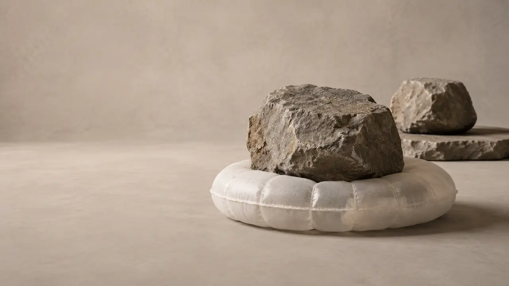

# Air Is Not Less Compute Than Stone

## A stone and an air mattress can both hold you up. They do not preserve that support through the same relation.

> **Image Caption:** The air does not become stone. A sealed boundary lets a different persistence relation carry the same load.

Loose air cannot be your bed. Seal it inside a shaped boundary and it can support your body all night.

That simple fact hides a useful contradiction.

A stone already seems like the kind of thing that can hold you up. It keeps its shape, resists your weight, and passes the load into the ground. Air seems like the opposite. Swing your hand through a room and the air moves aside. Lie down on nothing but loose air and you meet the floor.

Yet an air mattress can support the same body.

The usual reaction is to say, “Of course. The air is compressed.” That is true, but it is not the whole answer. Compressed air without a sealed skin still escapes. A sealed bag without enough internal pressure folds. A pressurized cushion without a floor falls with you. The bed is not the air by itself. It is a relation among air, boundary, body, outside atmosphere, and ground.

This matters because it separates two questions that are easy to blur:

How does the support work physically?

And what does that difference mean inside a universe made of relation?

The first question has a solid scientific answer. The second is where the framework begins—and where it must remain careful.

## Pressure is not a metaphor

Pressure is force distributed across an area:

\[
p = \frac{F}{A}
\]

If the same force is spread across more area, the pressure is lower. Concentrate it onto less area and the pressure is higher. This is an ordinary measured quantity with the SI unit pascal, equal to one newton per square metre. There is nothing fictional about it. [OpenStax introduces pressure through exactly this force-per-area relation](https://openstax.org/books/physics/pages/12-2-first-law-of-thermodynamics-thermal-energy-and-work).

Inside a gas, molecules move in many directions and collide with the containing surface. Each collision transfers momentum. Across a huge number of collisions, the wall experiences a steady force. Divide that force by the area over which it acts, and you have pressure. [Kinetic theory connects this visible pressure to molecular motion](https://openstax.org/books/university-physics-volume-2/pages/2-2-pressure-temperature-and-rms-speed).

The mattress becomes useful when its inside pressure can remain above the pressure pushing from outside, by enough to balance the load while the material holds together. Your body presses down. The top surface bends. Air shifts and is compressed. Internal pressure pushes against the whole skin, while tension in the fabric carries forces around the shape. The lower surface pushes into the floor. The floor pushes back.

That pressure difference is what matters. Absolute pressure is important in the equations, but a useful mechanical effect across a boundary comes from the difference between the two sides.

For an ideal gas, one compact relation is:

\[
pV = Nk_{B}T
\]

Pressure \(p\), volume \(V\), molecule count \(N\), and absolute temperature \(T\) are linked. Hold the amount of gas roughly fixed and reduce its volume, and the pressure rises if the temperature does not fall enough to cancel it. Real mattresses are more complicated than an ideal-gas exercise, but the equation makes the basic connection visible. [OpenStax gives both the ideal-gas law and its limits](https://openstax.org/books/university-physics-volume-2/pages/2-1-molecular-model-of-an-ideal-gas).

## The boundary changes what the air can do

The air in the mattress has not stopped being a gas. Its molecules have not locked into the neighbour arrangement of a solid. They remain mobile.

What changed is the set of routes available to them.

Loose air can move away when you press on it. The mattress skin blocks that easy escape. Seams and internal baffles stop all the air from rushing into one useless lump. The flexible surface changes shape, but only within the shapes that the fabric, joins, and internal cells permit. The ground closes the load path underneath.

Open the valve and the same air loses that role. It leaves the enclosed relation, the pressure difference falls, and the bed collapses. Nothing about the air has become less real. The supporting system has lost the organization that let mobile matter carry a stable load.

So the phrase “the air holds you up” is useful shorthand, but it leaves out most of the mechanism. A more complete sentence would be:

The contained gas, strained membrane, outside atmosphere, body, and ground hold one another in a load-bearing arrangement.

That is less catchy. It is also closer to the truth.

## Stone carries the load another way

A stone does not need an inflated skin to keep its parts from flowing around your hand. Its atoms and molecules already sit in a much more constrained arrangement. When a load presses on it, internal forces change slightly. The material develops stress; it undergoes strain; and, below its failure limits, its structure resists deformation.

Stress is again force measured over area. Strain describes the resulting change in shape relative to the original shape. Elastic moduli describe how strongly a material resists particular kinds of deformation. [Those relations are the ordinary language of solid mechanics](https://openstax.org/books/university-physics-volume-1/pages/12-3-stress-strain-and-elastic-modulus).

The stone is not perfectly motionless inside. Its components vibrate. Under enough load it deforms, cracks, or crushes. “Solid” does not mean “unchanging.” It means that, across the scale and conditions we care about, the material preserves a constrained shape and transmits stress through its internal organization.

The mattress also deforms, but deformation is part of how it works. It changes shape until gas pressure, membrane tension, the body load, outside pressure, and ground reaction settle into balance.

Same visible job: support a body.

Different physical organization: a solid network resisting deformation, or a mobile gas confined inside a tensioned boundary.

## Density is not the answer by itself

It is tempting to call stone “more solid” because it is denser. But mass per volume does not tell you, by itself, whether something can preserve a load-bearing shape.

Dense liquids still flow unless a boundary contains them. Many low-density foams and engineered shells can bear useful loads because their geometry and material relations resist deformation. A material’s density matters, but so do bonding, structure, pressure, temperature, shape, boundary conditions, and the kind of load applied.

This is the first important correction for the framework: ordinary physical density is not computational budget. We cannot point to more kilograms per cubic metre and say, “There is more fundamental compute here.” Nor can we look at a gas and say it receives less reality because its neighbours are freer to change.

Air and stone both fully participate in the world. What differs is the organization that remains stable.

## Equal participation is not identical organization

The framework begins from a common primitive rule of relational participation. But a common rule does not require every composition to preserve the same distinctions in the same way.

> **Resolution Equality does not imply Resolution Sameness.**

That sentence is the center of this Bit.

At the most basic level, the proposal does not rank stone above air. It does not imagine that the stone owns a larger jar of compute while the gas receives a smaller ration. Relational capacity is composed through relations; it is not a private substance stored inside an isolated object.

What persists depends on what the composed relation keeps distinguishable.

A stone-like organization keeps many local neighbour relations comparatively constrained. That lets the whole domain remain referable through a stable shape. A gas-like organization allows much more local re-seating. Its identity does not depend on each molecule retaining one fixed neighbour.

Put the gas inside a sealed, shaped membrane and a larger relation appears. The useful persistent thing is no longer “air alone.” It is the enclosed system: gas, skin, cells, outside pressure, load, and supporting ground. Mobile local relations can now contribute to a stable large-scale result because the boundary denies some routes and redirects force through others.

> **The air does not become stone. The relation that preserves the load changes.**

This is also why the comparison must be anchor-closed. If we compare only “air” with “stone,” we silently remove the membrane and ground that make the mattress possible. A fair comparison follows every consequential support until the load path closes.

## Pressure is real on the Stage

The framework calls pressure a Stage-visible quantity. That phrase can sound dismissive if “Stage” is mistaken for “illusion.” It means the opposite.

The Stage is where relations become available in a form that anchored observers and instruments can compare. Pressure is what appears when a load-bearing relation is resolved as force across a resolved area. The force is measurable. The area is measurable. The pressure is measurable. Engineers can predict with it, build with it, and be hurt by it.

Saying pressure is not primitive is no stranger than saying temperature is not one molecule. A derived quantity can be completely real at the level where it does work.

What the framework adds is a proposed placement: pressure is not the hidden substance that makes the mattress real. It is a reliable surfaced reading of how the enclosed relation meets another anchored relation across area.

That is an interpretation of the physics, not a replacement for the physics.

> **Article Slot:** URL: https://soutame.substack.com/p/why-does-an-air-conditioner-have

## Matter may be different persistence regimes

This opens a larger possibility. Gas, liquid, and solid may be understood, inside the framework, as different persistence regimes of one relational ground: different patterns of neighbour constraint, anchoring, mobility, boundary dependence, and reusable support.

That remains a candidate correspondence. The framework has not derived the ideal-gas law. It has not produced elastic moduli from its primitives. It has not calculated a phase boundary, a pressure curve, or the measured sag of an air mattress. Standard thermodynamics, statistical mechanics, and materials science already do quantitative work that this proposal must eventually recover.

Until it can do that, “persistence regimes” is a disciplined way to organize the question—not yet a new theory of matter.

The skeptical test is simple: does this language eventually compress several successful physical descriptions into one precise account, or does it merely rename structure as relation? The air mattress gives the proposal a clear qualitative target. It does not settle the quantitative debt.

But it does remove one bad intuition.

Air is not a weaker grade of reality waiting to become stone. Stone keeps its shape by holding many internal relations tightly. An air bed keeps its shape by giving mobile relations nowhere else to go, then sharing the load through a boundary and into the ground.

The support is real in both cases.

What differs is how persistence is resolved.
