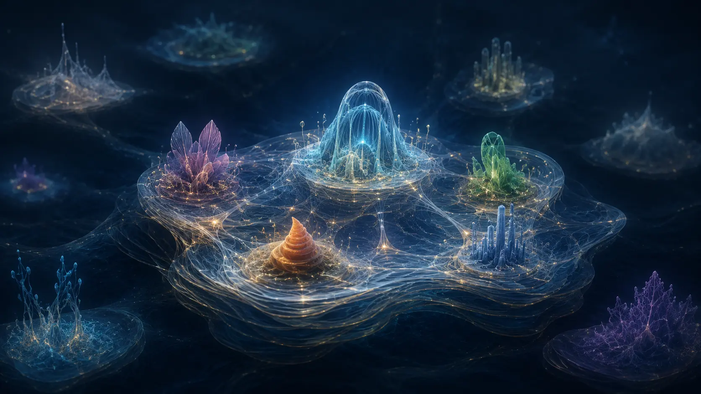

# What If Reality Is the Dream That Learned to Anchor Dreams?

*What if stable reality survived not by defeating every alternative, but by turning successful relation into ground that could carry more?*

> **Image Caption:** A shared ground does not have to erase smaller worlds to carry them.

A dream can contain a world.

It can have places. Rules. People who matter. Events that follow from what happened before. It can even surprise the person dreaming it.

For a while, the world holds together.

Then the dream ends.

Not necessarily because something inside defeated it. The larger ground carrying it changed, and the dream could no longer continue as one coherent world.

That gives us a strange question:

> **What would make a world able to carry more of the ground for its own continuation?**

This article comes from **The Hope Behind the Framework**—the personal speculative origin picture kept separate from the framework itself. It is a thought experiment, not a claim that this is how the universe began.

But we can still follow the idea seriously.

## Before there were finished things

Imagine that reality did not begin with objects already sitting inside space.

Begin instead with undivided logical ground.

No first object over here. No second object over there. Not even a ready-made *here* and *there* waiting between them.

The first important event would be a difference becoming consequential.

In the framework, this is the **Cut**. But the Cut does not make two finished pieces and then ask relation to connect them.

> **The Cut is relation.**

One ground takes on two distinguishable roles while still holding them together. There is enough split for the roles to differ, and enough shared ground for the difference to belong to one relation.

> **A relation is a distinction held together.**

Once that relation seats, it becomes more than a description. It becomes part of the ground from which another relation can form.

That gives a small recursion:

`relation seats`
→ `relation becomes reusable ground`
→ `ground supports further relation`
→ `a richer domain can form`

This part belongs to the current framework. What the Hope adds is the larger speculative picture that follows.

> **Article Slot:** URL: https://soutame.substack.com/p/a-universe-made-of-logic-758

## Temporary worlds of logic

Suppose many coherent logical organisations could form before any one organisation became stable enough to serve as shared reality.

Call them temporary **worlds of logic**.

These are not quantum many-worlds. They are not finished universes branching inside an existing spacetime. They are provisional ways for relation to organise before stable common ground exists.

Each world can continue only through whatever distinctions it can keep consequential and whatever ground its relations can maintain.

If it loses enough of that support, it stops participating as one.

That is what collapse means here.

No outside destroyer is required. The organisation simply becomes unable to carry the distinctions that made it this world rather than another.

The dream ends because its ground can no longer carry it.

## Maybe the strongest world is too brittle

The easiest story says that many worlds appear, one becomes the strongest, and it destroys the rest.

But strength may not be the most useful property.

A world that can survive only by preserving one exact organisation has a problem. Every deviation threatens it. Every alternative must be settled or removed. The world has to keep paying for distinctions that a broader organisation might safely leave open.

A different architecture could be more durable:

`keep compatible alternatives coarse`

`resolve a distinction when it becomes consequential`

`let the successful relation become reusable ground`

`open further possibility from that richer ground`

The full loop is:

`ground`
→ `possibility`
→ `consequential distinction`
→ `new seated relation`
→ `richer ground`
→ `wider possibility`

The point is not that possibility costs nothing. The ground carrying those alternatives still has to stand. The economy comes from not resolving every fine route separately before any present relation needs the difference.

> **Article Slot:** URL: https://soutame.substack.com/p/the-possibility-lane

## Difference does not always need to disappear

Now comes the important turn.

Imagine several temporary worlds, each carrying some coherent relation. Then imagine a broader organisation whose ground can support compatible parts of those worlds within it.

The result does not have to be:

`one world survives`
→ `the others are erased`

It could instead be:

`compatible relations survive`
→ `they remain distinct inside wider shared ground`

The smaller worlds may stop standing independently while some of what they established continues inside the larger domain.

Even incompatibility does not always require deletion. If a difference can be preserved as a stable relation, then the disagreement itself can become part of the ground.

The wider world becomes harder to replace not because it has made everything identical, but because it can carry more difference without losing its unity.

> **The universe that persists may not be the strongest dream. It may be the dream large enough to hold other dreams without deciding all of them in advance.**

## When a dream begins to become its own host

Here, **anchor** does not mean a giant physical object pinning something down.

An anchor is already-seated relational ground that another distinction, relation, or domain can reuse as support.

So a world begins to change when what happens inside it does more than pass through.

`organisation carries a stable constraint`
→ `some relations become consequential`
→ `those relations seat`
→ `what seated becomes more ground`
→ `later relations can reuse that ground`

Its successful continuation is now helping to support what happens next.

The world is no longer only being carried. It is increasingly contributing to the ground by which it continues.

And if that ground can also carry compatible structures that once needed separate support, the world begins to anchor other dreams too.

This does not prove that the universe is conscious. It does not require an outside dreamer. The dream is only an analogy for coherent organisation that is hosted.

The real question is simpler:

> **What makes a world able to keep carrying itself?**

## The altered origin question

Maybe stable reality did not become reality by making every correct decision at the beginning.

Maybe it persisted by not deciding what did not yet need to be decided—and by turning each successful consequential relation into more ground for what could come next.

Then reality would be less like the winner of a single cosmic contest.

It would be a recursive achievement: a world becoming able to preserve compatible difference, let that difference form relation, and let relation become support for still more difference.

A normal dream ends when its host can no longer carry it.

The Hope asks whether stable reality could be the stranger case: a dream whose successful relations progressively became more of the host.

Not the dream that defeated every other dream.

> **The dream that learned how to anchor dreams.**
