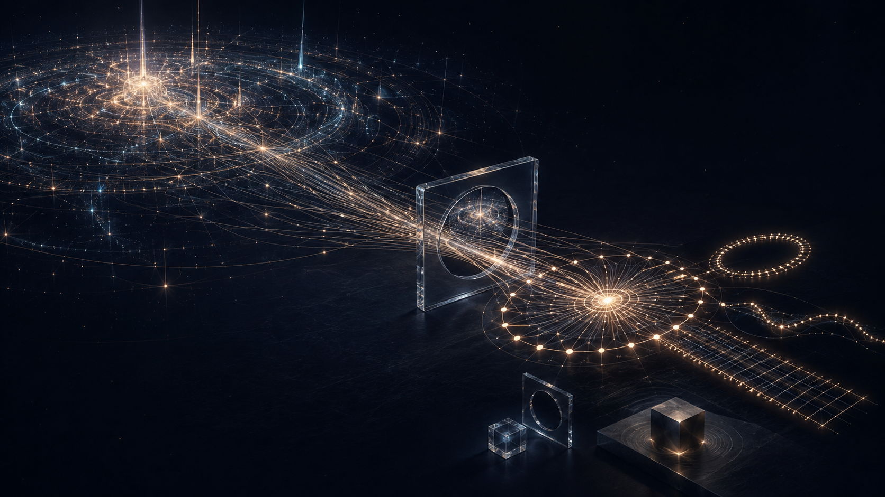

# Stage Is Where Light Meets Space

*Perception may be the most ordinary form of relativity.*

> **Image Caption:** The remote structure does not physically become small. Its outward relation crosses Stage and becomes a compact inward relation for another anchored domain.

Hold one finger in front of your face.

A distant building can disappear behind it.

Nobody thinks the building physically shrank. The building is still huge. Your finger is still small. What changed is the relation that reached your view.

Ordinary optics explains this through angular size: an object's apparent size depends on the angle it occupies at the eye, and a larger angular image produces a larger retinal image. [OpenStax gives the standard account here](https://openstax.org/books/university-physics-volume-3/pages/2-7-the-simple-magnifier).

We learn this so early that it stops feeling strange.

But perhaps perspective is strange in exactly the right way.

A large remote structure becomes a small local relation without becoming a small object. Your view never receives the building absolutely. It receives a relation between the building and you.

> **What if perspective is not a special trick performed by eyes? What if eyes simply make the universe's ordinary relation-resolution rule obvious?**

## Stage is where Light meets Space

An old lore phrase behind this framework says:

> **Stage is where Light meets Space.**

The capital letters matter because these words are not being used in their narrow everyday sense.

**Light** means relation of any kind, not only photons. Touch is Light in this sense. A measurement is Light. A distance comparison is Light. Anything that makes two domains consequential to one another carries Light.

**Space** means a domain capable of anchoring relation. It is not only empty three-dimensional container space. A body, an atom, a planet, an instrument, or a stable coarse composite can all act as Space for a relation.

**Stage** is what becomes measurable when relation resolves against that domain.

The root form is:

`Relation + Domain → Stage`

There is no primitive time term in it.

> **Perception is the Stage-side resolution of relation against a domain.**

And this is important:

> **Stage is resolved reality.**

It is not a hallucination placed over a more real world somewhere else.

> **Article Slot:** URL: https://soutame.substack.com/p/a-universe-made-of-logic-758

## Relation has a side

The older P-lane theory already had two names for a distinction the framework kept using without naming clearly.

**Afference** is relation reaching inward.

It is the perception side of the domain.

**Efference** is relation reaching outward.

It is the perception side of Space.

Both require budget.

These are not two substances, and inward and outward are not absolute cosmic directions. They are orientations relative to whichever domain is anchoring the Stage.

Suppose Domain A reaches toward Domain B.

From A's side, the relation is Efference:

`Domain A → Efference`

When that same relation becomes seated against B, its side flips:

`Domain A Efference → Stage → Domain B Afference`

Nothing had to vanish and be replaced. The same relation that was outward from A becomes inward for B.

This makes Stage more than the place where a result appears.

> **Stage is the turning interface where one domain's outward relation can become another domain's inward perception.**

B can then resolve what arrived through its own structure and reach outward again:

`B Afference → B resolves → B Efference → Stage → another Afference`

What one domain calls action can therefore be another domain's perception. What arrives inward can become ground for the next outward relation.

The universe does not need an outside Actor standing beyond the Stage to pass every relation by hand.

## The flip can become persistence

Now let the relation return.

A domain receives Afference, resolves it through its seated structure, produces Efference, and meets Stage again. If the returning relation can continue the same coarse domain, the movement can form a loop:

`Afference → domain resolution → Efference → Stage → Afference → ...`

> **A stable Afference–Efference loop can become the recurring relation through which a domain persists.**

This is not a free-energy claim.

Budget here is resolving capacity, not physical energy secretly created by the loop. A stable returning relation can reuse already-resolved ground instead of rebuilding every internal distinction from nothing at every pass.

Persistence, in this reading, is not merely a thing sitting unchanged inside a stream of time. It is a domain repeatedly remaining resolvable as the same coarse relation.

That also gives the previous clock Bit a deeper root. A clock is one selected repeating persistence loop. Its reading counts a surfaced consequence of that loop. The count is real, but the count does not have to be the ontology underneath it.

## Perception does not require consciousness

The word *perception* can make this sound mind-first.

That is not the claim.

A detector receiving a signal has relation. A ruler meeting an endpoint has relation. A rock resting on Earth has relation. Two particles interacting have relation.

Vision is perception in this broad Stage-side sense, but it is not the definition of perception.

Conscious experience is one elaborate participant. It does not make an otherwise unreal universe appear by looking at it.

The Stage is the resolved relation itself.

This is why distance is no longer a primitive thing that exists first and waits to be measured. A ruler is another domain. A coordinate system is another resolved structure. A clock is another persistence relation.

Distance and duration are Stage outputs.

The framework therefore does not begin with `absolute distance / absolute time = absolute speed`. Neither absolute distance nor primitive time appears at the root.

## Resolution Equality

This does not mean a distant domain is given a smaller piece of the universe because it appears small from here.

The correction is the opposite:

> **The universe gives the same fundamental total resolving capacity everywhere.**

What differs is arrangement.

One relation can commit more distinctions now. Another can remain coarse. One can be projected through a narrow cross-domain relation. Another can be finely seated in a local ground.

Equal total resolving capacity does not mean identical local state. It does not mean every object owns the same private budget account. It means the difference must come from relation, commitment, grain, projection, and unresolved possibility—not from one region receiving a lesser universe.

## Why local `c` remains the same

Standard special relativity says the laws of physics take the same form in inertial frames and that every inertial observer measures the same vacuum light speed. [Einstein Online summarizes that standard position here](https://www.einstein-online.info/en/explandict/inertial-observer/).

The framework must preserve that measurement.

Locally, ruler, persistence loop, propagation relation, vacuum relation, body, and anchor are seated in one ground. They co-resolve.

If a common local change affects the standards together, comparing one local standard with another can hide the shared change.

So the intended statement is exact:

> **c is operationally invariant locally, but not treated as ontologically primitive as an absolute distance-per-absolute-time speed.**

This does not predict that an ordinary local laboratory should measure arbitrary vacuum light speeds.

It says the constant belongs to one co-resolved local measurement relation, while distance and duration remain Stage outputs inside that relation.

## Watch from very far away

Now imagine an impossible side view.

Two distant stars have a local relation corresponding to four light-years. Through your viewport, the whole separation occupies four centimetres. You watch the relation resolve across that image for four of your local years.

Your viewport can display something like one centimetre per year.

Ordinary physics calls that an image-plane or angular rate. It is not the remote system's locally measured vacuum `c`.

Exactly.

That is the useful part.

You did not receive the remote relation absolutely. You received it resolved into your Stage.

Approach it. Magnify it. Build a finer instrument. The same remote structure can occupy more of your available resolution without the star system physically growing.

> **A domain never receives another domain absolutely. It receives the relation between them, resolved at its own grain.**

In P-lane terms, remote Efference becomes local Afference at Stage. The receiving domain resolves that Afference at the grain its present relation can support.

Perspective may be the minimum-dimensional example of cross-domain projection.

## Why the right triangle keeps returning

The clock and ruler Bits reached a simple complementary geometry. This article can write the wider form as:

`R_all² = R_local² + R_relation²`

This is not a universal equation for every Stage.

It belongs to the simplest low-bias case: one bounded invariant closure, two independently consequential projections, and no additional bias that needs to tilt their relation.

Under those conditions, orthogonal projections are the least-biased way to keep both distinctions inside one bounded whole.

That is why the same mathematical shape can appear in a persistence reading and a length reading. The framework asks whether the equations are tracks left by a common projection geometry.

When more anchors, relations, or consequential biases participate, the angle can change and the compact law can give way to richer state-dependent description.

The triangle is a clean case, not the whole universe.

## If the ruler changes with everything around it

Suppose every local ruler changes together.

Your body changes with it. Your clock loop changes with it. Your local propagation standard changes with it. The nearby ground changes with it.

Which local ruler reveals the common change?

> **The ruler cannot measure itself.**

This opens a framework cosmology candidate:

> Apparent cosmic expansion may be the reciprocal reading of co-shrinking or increasingly fine local resolution rather than the literal production of more space.

If a present ruler resolves more finely, an older or remotely seated relation can occupy more present ruler units. From inside the local ruler system, the reciprocal reading looks like the separation grew.

This is not established cosmology. A real alternative would have to reproduce the same successful web of redshift, distance, lensing, background-radiation, and structure-growth measurements—not merely rename expansion.

## Coarse is where possibility remains

Resolution Equality also changes what *coarse* can mean.

Coarse does not mean that the universe became weak, blurry, unfinished, or less real.

A fine relation might seat:

`A → B → C → D → E → F`

A coarse relation can seat:

`A → [open relation] → F`

The missing intermediate distinctions do not need to be erased. They can remain unresolved until something makes one of them consequential.

> **Coarse resolution carries more unresolved possibility per resolved step.**

That is how a broad relation can remain affordable without secretly prewriting every fine path inside it.

> **Nothing is decided until it needs to be decided.**

Perspective shows the same economy. A distant city can remain a real, complex local domain while your present relation to it resolves only a small silhouette. More detail can become available when a finer relation makes it consequential.

## Gravity may be Stage-side perception too

Now use *perception* in the same broad physical sense for gravity.

A domain on Earth is already consequentially seated inside Earth's enormous anchored relation. The framework does not need Earth to be an invisible Actor reaching out and pulling it by hand.

> **Gravity is a Stage-side perception of being consequentially anchored inside another domain.**

In Afference/Efference terms, the anchor relation arrives inward as part of what the local domain resolves, while that domain's own Efference continues outward through the anchor.

Standard general relativity describes gravity geometrically. In a sufficiently small freely falling region, physics approaches the inertial case; the falling observer is locally weightless, while standing on a floor produces support, pressure, and weight. [Einstein Online explains the equivalence-principle comparison](https://www.einstein-online.info/en/spotlight/equivalence_principle/) and the standard geometric account of gravity [in this companion article](https://www.einstein-online.info/en/spotlight/geometry_force/).

The framework preserves that observation but reads it differently.

Free fall is a candidate case in which body and nearby Stage co-resolve along the anchor relation. Standing on the ground adds another anchored relation that prevents the same free resolution. The competing support relation becomes locally measurable.

That correspondence does not prove the ontology. The framework still owes the quantitative structure that standard general relativity already supplies.

> **Article Slot:** URL: https://soutame.substack.com/p/where-the-framework-currently-stands

## There may be no view from nowhere

We often imagine that the universe must possess one absolute true size, rate, distance, and position outside every measurement. Observers then see distorted versions of that hidden original.

The framework asks whether that external view ever existed.

There is Domain.

There is Relation.

There is Stage.

Different domains can resolve the same relation differently without one Stage being fake.

But perspective needs a careful balance.

Complete unity leaves no meaningful other viewpoint. If one domain is simultaneously every consciousness, every body, every Stage, every Actor, and every observer, nothing genuinely arrives from another side.

Complete disconnection also fails. No preserved relation means no shared Stage.

So perspective needs:

`enough separation for distinct resolution`

`+`

`enough preserved relation for measurement`

`→ Stage`

## Why the old Anchor became a Reader

Only after the conceptual structure is clear does the older Anchor lore become useful.

The Anchor had too many interests for one resolution path. If one perspective finely resolved every possibility, the world would become only that perspective's choices.

So interests split into egos and other viewpoints. Different domains could carry different paths while remaining related enough to share a Stage.

The remaining Anchor kept broad interest and enormous connection, but its preferred role changed.

Programmer.

Architect.

Reader.

Observer.

Viewer.

> **It wants to know what the story becomes, but it does not want to write every sentence itself.**

That line is lore, not empirical evidence. But it preserves the same architecture.

A world needs enough connection to remain one world and enough separation for another perspective to bring back something the Anchor did not resolve alone.

## The ordinary rule underneath the set

The current set began with clocks, rulers, and the twin paradox because relativity makes their differences hard to ignore.

But the root may have been visible before any equation.

`Light` is relation.

`Space` is domain or anchor.

`Stage` is where relation becomes measurable and can flip orientation.

`Afference` is relation reaching inward.

`Efference` is relation reaching outward.

`Persistence` can be a stable returning Afference–Efference loop.

`Perspective` is how another domain's Efference resolves as this domain's Afference at the grain available here.

The clock was one persistence reading.

The ruler was one extended projection.

The twin journey was one completed path comparison.

Perspective is the embarrassingly ordinary version we use every day without asking what it means.

> **Everything measurable is relation crossing Stage, and perspective is what that crossing looks like from one anchored side.**

The building was never inside your finger.

Your Stage simply resolved their relation that way.

> **The universe may use perspective everywhere. We only gave it a special name when our eyes made the geometry obvious.**
