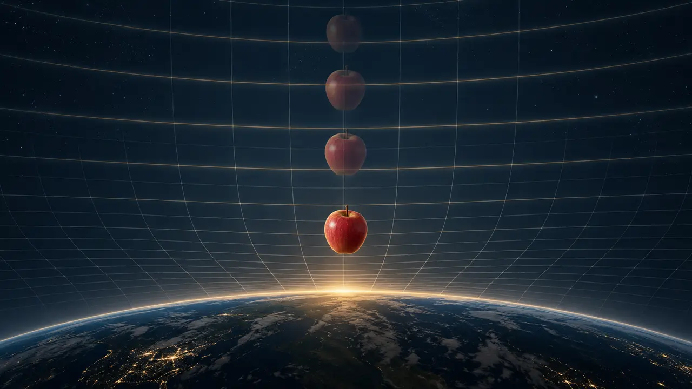

# The Apple Falls the Same Relational Distance Every Time

*Maybe acceleration is what equal relational steps look like after Stage gives us a ruler.*

> **Image Caption:** Equal bands in a stretched relational chart can occupy unequal distances in the ruler that Stage presents. This is a conceptual illustration, not measured gravity data.

Hold an apple above the ground and let go.

At first it moves a little. Then more. Then more again. If we divide the fall into equal clock intervals, the apple crosses a larger distance during each later interval.

This is ordinary acceleration. Near Earth's surface, when air resistance can be ignored and the change in height is small enough, we approximate the acceleration as constant. An apple released from rest then falls a distance

`s = 1/2 g t²`.

[NASA's free-fall guide](https://www1.grc.nasa.gov/beginners-guide-to-aeronautics/free-falling-objects/) gives the familiar equations. The [Eöt-Wash equivalence-principle experiments](https://www.npl.washington.edu/eotwash/equivalence-principle) push a second fact much harder: different test bodies fall alike to extraordinary precision when other effects are controlled.

Those are not the parts I want to remove.

The apple falls. The later distance is larger. Any new gravity account has to recover that.

What I want to question is something quieter:

> **What is the distance we are watching a distance of?**

## Before the ruler appears

My earlier way of speaking about gravity was that gravity warps length. A dense anchored domain makes the available separation contract, so the apple falls because there is less effective space left between apple and Earth.

I now think that starts one step too late.

It treats length as though it were already completed, then asks compute budget to bend it. But in this framework, length is not waiting outside relation as a finished container. Length is one reading produced when relation and domain resolve together.

The order should be:

`Relation + Domain + available relational budget`

→ `resolution`

→ `Stage`

→ `length, duration, frequency, shape`

So the deeper claim is not simply that gravity warps length.

> **Gravity is a warping of perception by relational budget.**

Here, perception does not mean that a human looks at the apple incorrectly. It does not require a brain, an eye, or a conscious observer. Perception means the domain-relative result that appears on Stage when an encounter resolves.

The apple participates in such a result. A clock does. A detector does. Earth does.

Stage is where Light meets Space in the framework's vocabulary: relation meets an anchoring domain. The package that appears is not a fake picture laid over a more real world. It is the real consequence available at that grain.

> **Article Slot:** URL: https://soutame.substack.com/p/stage-is-where-light-meets-space

## The apple and Earth form another relation

Let `A` be the apple and `E` be Earth.

The apple already has its own supported relations. Earth has an absurd amount of seated relation. When apple and Earth become consequential together, they also form:

`R_A + R_E + R_AE → R_all(A↔E)`

This is not normal addition. It says that apple, Earth, and their seated relation participate in one Apple–Earth closure.

`R_all(A↔E)` is the full locally capped resolving participation of that relation. It is not a universal computer allowance split between two objects. The apple keeps its other supported relations. Earth keeps its own. Their new relation receives the same local rule as every other actual relation.

This matters because Earth does not meet the apple as an empty ball labelled “mass.” Earth arrives with an enormous amount of anchored relation already seated. The consequence can accumulate in the apple as Earthward bias without Earth handing it saved pieces of `R_all`.

This is the limited sense in which I use *environment compute overflow* here: Earth-side support remains available through `R_AE`. It does not mean that spare computing tokens leak out of Earth.

What grows is reusable relation, not an uncapped budget.

## Let go

While I hold the apple, gravity has not disappeared.

There is an Apple–Earth relation, an apple–hand relation, and a hand–Earth relation. My hand provides another constraint on how the next resolution can seat.

When I let go, I do not create gravity.

I remove the support that was preventing one already established continuation. The Apple–Earth relation remains. In this candidate picture, Earthward continuation becomes the cheapest compatible resolution.

The same view gives weight an interesting place. An apple resting on a table is not less related to Earth than a falling apple. The table and ground must keep resolving against the continuation that the apple would otherwise follow. What we call load is the surfaced consequence of that prevented continuation.

That is still a candidate account. I have not yet derived the numerical force on the table. But it explains why support belongs inside the relation rather than being added after gravity has already done its work.

## Stretch the ruler instead

Now I want to describe the same Apple–Earth separation in two ways.

Let:

- `r_n` be the ordinary distance Stage presents after resolution step `n`;
- `U_n = F_E(r_n)` be an Earth-anchored, compute-stretched reading of the same relation.

`F_E` is not yet known. It names the mapping that this framework would have to derive.

In the stretched reading, suppose the apple loses the same amount of unresolved Apple–Earth separation on every closure:

`U_(n+1) = U_n - ΔR_AE`.

Then:

`r_n = F_E^(-1)(U_0 - nΔR_AE)`.

That is what I mean by the title.

> **The apple falls the same relational distance every time.**

I do **not** mean that it crosses the same number of metres every second. I have not even introduced seconds yet. `n` is a count of relevant resolutions, not a primitive universal clock.

I mean that the Apple–Earth relation may deduct the same amount from its remaining stretched separation each time it resolves.

If `F_E` is nonlinear, equal steps in `U` do not have to become equal steps in `r`.

Picture equally spaced marks drawn on a sheet. Now compress the sheet more strongly near Earth. The marks remain equal in the uncompressed chart, but their displayed gaps change. Moving by one mark every step can become a changing distance when measured on the compressed side.

Flip the chart, and the same thing can be described as stretching the ruler until equal relational work occupies equal intervals.

This does not mean the apple literally becomes gigantic above Earth. It does not mean space hides a computer grid. Contraction and compute-stretch are inverse ways of presenting the same resolved relation.

In the ordinary Stage chart, the apple can cover more displayed distance during each later interval.

In the stretched relational chart, the same amount may have been subtracted every time.

## Where acceleration enters

A clock is another maintained relation. It repeats some supported change and lets us label other changes against it.

Only after a selected clock maps its cycles onto the sequence of Apple–Earth closures do words such as velocity and acceleration enter.

> **Article Slot:** URL: https://soutame.substack.com/p/the-clock-reading-is-not-the-ontology-8d6

This is why a constant `ΔR_AE` does not automatically derive constant terrestrial acceleration.

Different choices of `F_E` can turn equal relational steps into many different ordinary trajectories. To reproduce a fall from rest near Earth's surface, the combined map from closure count to clock time and from `U` to `r` must give approximately the familiar quadratic distance. Farther away, it must stop pretending that `g` is constant and recover the measured radial behavior.

The equation above is therefore a construction, not a completed gravity law.

But the construction exposes the possibility I care about:

> **Acceleration may describe how equal relational deductions are displayed by a changing ruler and clock relation, rather than how an object receives ever more primitive motion through a fixed background.**

## Down is not the same as sideways

The Earthward direction crosses a changing Earth-anchored resolution map.

A short horizontal path near one altitude can remain in approximately the same local ground. Its displayed mapping may therefore change much less over that path. The Apple–Earth relation still participates; “horizontal” does not mean “unrelated to Earth.” Curvature, rotation, altitude, atmosphere, and support still matter.

The point is only that a radial path crosses the proposed gradient directly, while a short tangential path can remain near one band of it.

That prevents the framework from turning every relation with Earth into the same downward effect.

## The ruler and the clock should agree

Gravity changes more than falling trajectories. Clock comparisons also depend on height.

[Chou and colleagues](https://doi.org/10.1126/science.1192720) measured the gravitational frequency difference between optical clocks separated vertically by only 33 centimetres. [Bothwell and colleagues](https://doi.org/10.1038/s41586-021-04349-7) later resolved gravitational redshift across a millimetre-scale atomic sample.

These experiments do not prove my relational-budget interpretation. They make its job harder and clearer.

If length and frequency are both Stage readings of differently anchored resolution, one coherent mapping family should recover both. I cannot use the apple's stretched ruler for falling, then quietly give clocks a completely different meaning when redshift appears.

The relation has to close.

## What still has to be solved

For this to become more than an ontological sketch, it must derive:

1. how the Apple–Earth closure determines `F_E`;
2. how a physical clock maps its cycles to closure count;
3. why the near-Earth limit gives the observed approximately constant `g`;
4. how the result changes with radius and recovers inverse-square behavior where that approximation applies;
5. why different test bodies share the same free fall;
6. how the same account produces measured gravitational redshift;
7. what observation distinguishes it from writing established gravity in another coordinate system.

If it cannot do those things, then the apple idea fails as physics, even if it remains a useful way to think about Stage.

I am also deliberately stopping here. Black holes, dark matter, dark energy, galaxies, and civilization-scale complexity belong to later deductions. Adding them now would hide the one correction this apple is supposed to make.

The apple is not crossing a prewritten cosmic grid. Apple and Earth are repeatedly resolving a relation. Stage packages each result, and our ruler and clock read the package.

We see the apple fall farther during each later equal clock interval.

But after stretching the budget-conditioned ruler back out, the underlying subtraction may be the same.

> **Maybe the apple accelerates in metres because it falls the same relational distance every time.**

> **Article Slot:** URL: https://soutame.substack.com/p/why-does-motion-make-a-ruler-shorter-aa1

> **Article Slot:** URL: https://soutame.substack.com/p/gravity-is-the-universe-deleting
