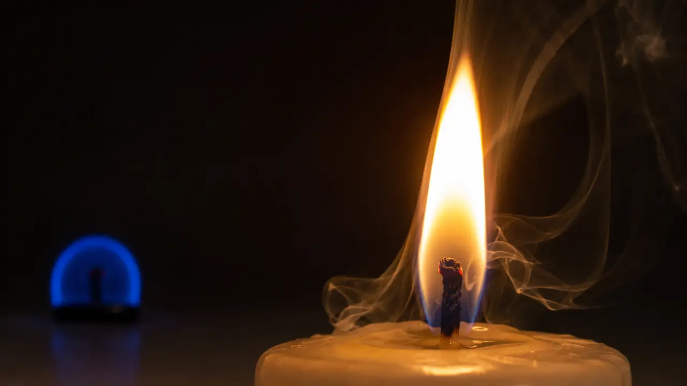

# What Is a Flame If Its Matter Never Stays?

*A candle keeps its identity while fuel, oxygen, heat, and reaction products continuously pass through it.*

> **Image Caption:** A flame can hold a recognizable identity even while the fuel, oxygen, products, and flow that make it are continuously changing.

Which part of a candle flame is the same part that was here five minutes ago?

Not the wax. The wax that fed the flame five minutes ago has already reacted or drifted away in hot products.

Not the oxygen. Fresh molecules keep arriving from the surrounding air.

Not the gases inside the bright shape. They move through it too quickly to serve as permanent members.

Not even the exact outline. A passing breath can stretch, flatten, or nearly erase it, and a calmer flame still flickers from moment to moment.

Yet we do not normally say that the candle has produced thousands of unrelated flames. We watch one flame continue.

That ordinary judgment hides a difficult question. If a thing can keep its identity while its material membership changes, what is the identity attached to?

## The wax does not burn as a solid block

A candle makes the process look simpler than it is. We see wax, wick, and flame stacked neatly above one another, so it is tempting to imagine that the wick itself is the fuel or that solid wax burns directly at the surface.

The actual cycle is more interesting.

Heat from the flame melts wax near the wick. Capillary action draws that liquid wax upward through the wick's small spaces. Near the top, more heat vaporizes it. The fuel that enters the main combustion region is therefore wax vapor, not a stream of solid wax climbing into the light.

That vapor meets oxygen diffusing in from the surrounding air. Chemical reactions release heat and form products, including carbon dioxide and water vapor. Some of the released heat returns toward the candle, melting and vaporizing more wax. The cycle continues while the conditions continue.

The [American Chemical Society's account of candle chemistry](https://inchemistry.acs.org/atomic-news/shining-light-on-candles.html) describes this feedback plainly: melting feeds capillary transport, transport feeds vaporization, and vaporized fuel feeds the flame.

The wick helps organize the supply, but it is not a little reservoir of flame-stuff. Wax enters. Oxygen enters. Hot products leave. Heat travels both into the next supply of fuel and out into the room.

The familiar object is maintained by throughput.

## A flame is where flows meet

In combustion science, a candle flame is a kind of diffusion flame. Fuel and oxidizer begin apart and reach the reacting region through transport and mixing. The [National Institute of Standards and Technology](https://www.nist.gov/glossary-term/21991) defines a diffusion flame by this separation: fuel and air mix or diffuse in the combustion region rather than arriving there already mixed.

That means the visible flame is not best pictured as a bag holding the same hot material. It is a region in which several processes keep meeting:

- fuel is supplied and vaporized;
- oxygen is transported inward;
- reactions occur where workable mixtures and temperatures meet;
- heat is redistributed;
- products are transported away.

None of this makes the flame unreal. A waterfall does not become an illusion because different water passes through it. A flame has measurable temperature fields, reaction zones, light emission, chemical products, and effects on nearby matter. Its identity is not less real because it is dynamically maintained.

But “dynamically maintained” also does not mean perfectly steady. A candle flame can reach a quasi-steady regime: its large-scale form and average behavior remain recognizable even while the microscopic events and small details keep changing. Under different fuel supplies, air currents, pressures, or oxygen levels, that regime changes. Push the conditions far enough and the flame goes out.

Continuity is constrained. It is not a license to call any later event the same flame.

## Gravity helps draw the shape we recognize

The teardrop shape feels so essential to a candle flame that we put it on icons. But much of that shape comes from the environment in which the flame is burning.

On Earth, hot combustion gases are generally less dense than the cooler surrounding air. Buoyancy carries them upward. Cooler, oxygen-rich air is drawn toward the lower flame while hot products rise away. That convective flow stretches the reacting and luminous regions vertically.

The yellow glow also depends partly on soot particles heated until they emit visible light. Flow and oxygen access affect where soot forms and whether it burns away. The familiar yellow teardrop is therefore not simply “the natural shape of fire.” It is one outcome of reaction, diffusion, heat transfer, gravity, and the surrounding gas working together.

Change an important relation and the flame can keep burning while losing that familiar shape.

## A candle without its teardrop

Microgravity provides a clean conceptual test because it greatly suppresses ordinary buoyant convection.

Without the same upward flow, fresh oxygen is not swept toward a candle flame in the familiar way, and hot products are not carried upward in the same plume. Diffusion becomes much more important to transport. In NASA's candle comparison, the microgravity flame becomes small, blue, and nearly spherical rather than tall, yellow, and teardrop-shaped. NASA explains both the [transport difference in space flames](https://science.nasa.gov/biological-physical/resources/explainers-infographics/why-nasa-is-studying-flames-in-space/) and the specific [one-gravity versus microgravity candle image](https://www.nasa.gov/image-article/candle-flame-1g-vs-microgravity/).

That does not mean every flame in microgravity must look identical. Fuel, geometry, forced airflow, pressure, and other conditions still matter. The careful conclusion is narrower: remove ordinary buoyant convection, and a candle flame can organize itself very differently while combustion continues.

This matters for identity.

If the flame's identity lived in one fixed collection of matter, it would already have failed on Earth. If it lived in one fixed teardrop outline, it would fail in microgravity. Yet there is still a meaningful continuity between the cases: fuel and oxidizer keep meeting in a sustained reaction region, transport keeps supplying and removing material, and heat feedback helps maintain the process.

The organization changes, but not everything consequential disappears.

## What must stay when the members do not?

We often use material continuity as a quick test of identity. This is the same stone because it is largely the same piece of matter. That shortcut works often enough to feel universal.

A flame shows its limit.

To identify a continuing flame, we instead follow a connected history. There is continuity of location around the wick, continuity of fuel supply, continuity of reaction, continuity of heat feedback, and continuity from one moment's organization into the next. Exact molecules may be replaced. Exact shape may bend. Even the dominant transport process may change. But enough of the organized dependence can remain consequential for us to track one continuing process.

This does not mean that “anything with a similar pattern” is literally the same flame. Light a second candle across the room and its flame may look almost identical, but it has a different causal history. Extinguish the first candle completely and relight it tomorrow, and whether we call that “the same flame” becomes a matter of convention precisely because the active continuity was broken.

Identity here is neither a secret substance nor a free-floating visual pattern. It is continuity through alteration.

## The framework reading

The framework uses the flame as an illustration of a broader possibility: a changing domain can remain itself when enough of its relational organization survives the change and continues to matter to what happens next.

That is a stronger claim than saying only that the flame looks similar. The incoming fuel depends on the heat produced by the previous reactions. The next reaction region depends on how fuel and oxygen were transported into it. The current flow helps set the conditions inherited by the next moment. The flame persists by actively maintaining a consequential relation among changing participants.

The phrase “actively maintaining” needs a guardrail here.

> **Framework budget is not heat, joules, chemical energy, fuel, oxygen, or reaction rate.**

Combustion still requires fuel, oxidizer, suitable temperature, and transport. Chemistry and fluid dynamics explain those physical requirements. The framework does not replace them, and it does not derive candle behavior from a new equation in this article.

Nor does one candle prove that every persistent thing belongs to a particular framework level. The flame is a structural illustration, not a classification test. It makes one feature unusually easy to see: stable identity need not mean stable material membership.

The framework adds an interpretive proposal. What persists may be an organized set of relations that keeps re-establishing itself across changes in its members and form. The flame is compelling because the replacement is visible. Its matter never stays, yet its previous organization remains consequential to its next state.

## The flame is real because it changes well

We sometimes treat change as the enemy of identity. The candle suggests almost the reverse.

The flame exists only because matter and energy move through it. Stop the wax supply, remove the oxygen, interrupt the heat feedback, or disrupt the transport beyond recovery, and the flame does not become more stable. It ends.

Its continuity is not found underneath the change. Its continuity is achieved through change that remains organized enough to support what comes next.

That gives us a more careful public claim:

> **A stable thing does not always require stable material membership. A continuing organization can preserve identity while its members and configuration change.**

The candle does not settle every question about identity. It does something more useful: it removes one easy answer. The same thing cannot always mean the same matter arranged in the same shape.

The wick is shorter now. The wax near it is not the wax that was there before. Oxygen has entered. Water vapor and carbon dioxide have left. The teardrop has trembled through countless outlines. Still, the flame has a connected history we can follow.

If none of the matter has to stay, and even the shape can change, what exactly must survive before we stop calling it the same thing?
