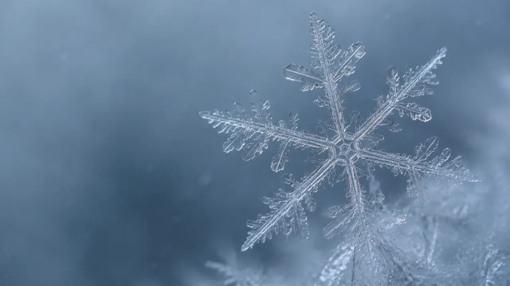

# Why Do Snowflakes Agree on Six Arms but Never on the Details?

*A snow crystal can follow one strict rule without carrying a finished plan for every branch*

> **Image Caption:** Sixfold order constrains the crystal's directions; temperature, moisture, instability, and growth history fill in the details.

A snowflake seems to contradict itself.

Look at one of the familiar star-shaped crystals. Six arms leave the center in a shared pattern. A new side branch on one arm may appear at almost the same distance as a branch on the others. The whole crystal can look coordinated enough that someone must have copied one arm six times.

Then look closer.

One branch ends early. Another forks. One side carries a small hollow or ridge. A collision has damaged one arm. Even when the whole crystal looks wonderfully balanced, its fine details are not perfect copies.

Compare it with another crystal and the differences become larger still.

So what is the snowflake obeying?

If the rule is strong enough to preserve sixfold order, why does it not force one exact design? If the details are allowed to vary, why does the crystal not grow in arbitrary directions?

The answer begins with a simple split:

> **The rule that constrains the broad structure is not a complete blueprint for everything that grows inside it.**

## Six directions come before six detailed arms

A snow crystal begins as water vapor deposits onto a tiny ice crystal in a cloud.

Ordinary ice has a hexagonal crystal structure. That molecular arrangement makes some surfaces and growth directions different from others. As the crystal grows, the underlying structure appears in the flat faces of a hexagonal prism and, in the right conditions, in the six broad directions of a stellar crystal.

This is why sixfold order is not a decorative accident.

But sixfold order does not mean that every snow crystal must become a flat six-armed star. Ice crystals can grow as plates, columns, needles, hollow columns, capped columns, dendrites, and many forms between them. The crystal structure constrains the directions available to growth. It does not choose one final silhouette by itself.

There is an important exception too. Atmospheric ice is not always a perfect example of ordinary hexagonal ice. [Research collected by NOAA](https://repository.library.noaa.gov/view/noaa/22275) describes threefold or trigonal ice crystals associated with stacking-disordered ice, where hexagonal and cubic stacking sequences are interlaced.

So “every snowflake has six identical arms” is too strong.

For ordinary hexagonal ice, however, the first part of the mystery is clear:

> **The crystal has a strong directional structure before it has a detailed branch pattern.**

## The same ice can grow into very different shapes

The next part depends on the cloud.

Snow-crystal shape changes strongly with temperature and supersaturation—the amount of water vapor available above the level needed for equilibrium with ice.

[Kenneth Libbrecht's Caltech overview](https://calteches.library.caltech.edu/681/02/Snow.pdf) shows the familiar morphology pattern. Plate-like crystals are common near some temperature ranges. Columns and needles appear in others. Near roughly -15 °C, suitable conditions can produce thin plates and elaborate stellar dendrites. More available vapor can push simple shapes toward faster, more complex growth.

Those temperatures are landmarks, not a recipe that prints one guaranteed snowflake. The boundaries depend on the actual conditions and on the growth process itself.

Why can a small temperature change matter so much?

An ice crystal has different kinds of faces. Water molecules do not always attach to all of those faces at the same rate. If the top and bottom faces advance slowly while the side faces spread, a plate can grow. If the balance reverses, the crystal can lengthen into a column.

At the same time, water vapor has to diffuse through the surrounding air before it can join the crystal. Growth therefore depends on both the surface and the route by which new material reaches that surface.

A [Physical Review E study](https://journals.aps.org/pre/abstract/10.1103/PhysRevE.86.011604) models this as diffusion-limited growth with direction-dependent surface energy and attachment kinetics. The point is not that a simulation contains the one hidden snowflake plan. It is almost the opposite: the same underlying ingredients can produce plates, prisms, columns, needles, and dendrites as the conditions change.

The lattice keeps the structure from becoming arbitrary.

The environment keeps the structure from becoming one repeated design.

## A bump can become a branch

Branching makes this interaction visible.

Imagine an almost flat growing edge. One tiny region sticks a little farther into the surrounding vapor than its neighbors. Because it reaches outward, it may receive water vapor more easily than a recessed region.

It grows faster.

Now it sticks out farther, which can improve its access again. A small difference has become the beginning of a branch.

This kind of positive feedback is part of the instability behind dendritic growth. It explains how very small differences can become large visible structures without requiring every branch position to have been written into the crystal at the beginning.

But the instability does not erase the lattice. The new branches still favor directions permitted by the crystal structure. Diffusion, surface attachment, and the shape already grown decide how quickly each permitted route develops.

The result is not rule or accident.

It is rule acting through a changing situation.

## Why the six arms can still resemble one another

If every arm is growing locally, why do the six arms often look so well coordinated?

A snow crystal is tiny. Its arms usually share almost the same large-scale temperature and moisture at the same moment. They also share one crystal structure. When the surrounding conditions change, all six arms encounter broadly the same change together.

That common history can place similar features at similar distances from the center.

No arm needs to send a construction plan to the other five.

They respond in parallel because they share the same broad conditions.

The agreement is never magical or perfect. A defect, collision, local fluctuation, small airflow difference, or drop of supercooled water can disturb one region more than another. The six arms share a setting, but they do not occupy the same exact place inside it.

That is why a real crystal can be recognisably symmetric without being a geometric copy.

## A shape made from a path

[NOAA's explanation of snowflake formation](https://www.nesdis.noaa.gov/about/k-12-education/ice-snow/how-do-snowflakes-form) gives us the last ordinary piece.

A growing crystal moves through a cloud. Along the way it enters different temperatures and different moisture levels. The order matters. So does the time spent in each region.

A plate grown under one condition becomes the starting shape for the next condition. A branch grown early changes how vapor reaches the surface later. Damage remains part of the geometry on which later growth continues.

The final crystal is therefore a physical biography.

Not a perfect weather log. We cannot read every collision or reconstruct every microscopic event from the finished shape. But the shape was produced by an accumulated sequence, and each stage changed what the next stage had available to grow from.

This is also why “no two snowflakes are alike” is better understood as extreme improbability than as a mathematical theorem. Simple crystals can look very similar. Two crystals may count as identical at one viewing scale and different under a microscope. Matching every branch, defect, and growth event becomes less plausible the more finely we compare.

The word *same* always needs a grain.

## Constraint is not a complete blueprint

Snow crystals show a distinction that is easy to lose in more abstract examples:

**shared rule is not shared detail.**

The hexagonal structure can constrain the whole crystal while leaving many branch patterns physically possible.

Temperature can favor a family of shapes without selecting one exact member of that family.

A growth front can permit a branch without deciding its exact position in advance.

History can narrow what happens next without having contained the finished picture from the beginning.

None of this makes the constraint vague.

A building rule can be exact about how much weight a floor must carry without choosing the furniture. Grammar can be exact about which sentence structures work without choosing the sentence that will be spoken. The rules of chess can be exact without containing a finished game.

The snow crystal gives us the same split in grown matter.

> **A rule can be exact about the structure it constrains without specifying every detail that later grows inside that structure.**

> **Article Slot:** URL: https://soutame.substack.com/p/why-do-rules-create-freedom

## The framework enters here—and only here

My GUT Deduction uses the word **coarse** in a narrow way.

Coarse does not mean blurry.

It does not mean weak.

It does not mean that one fully finished fine state already exists behind a foggy image.

In the framework, a coarse result can be a real constraint that leaves several finer distinctions unseated because the present relation does not require them yet.

The snow crystal offers a useful analogy.

Its sixfold constraint is not blurry. It is strong enough to remain visible across the whole crystal. Yet that constraint alone does not specify every branch. Many finer continuations remain compatible with it. Local growth conditions then make some of those differences physically consequential, and one detailed history grows.

In a careful shorthand:

`strong broad constraint`

→ `many compatible finer continuations`

→ `new local conditions make some differences matter`

→ `one finer history seats`

The analogy stops there.

The framework does not explain snowflake morphology by claiming that the universe spends a hidden “resolution budget” on branches. Snow crystals already have physical explanations in crystallography, thermodynamics, diffusion, surface attachment, and growth instability.

The crystal does not prove the framework's ontology.

It only makes one conceptual possibility easy to see:

> **Exact constraint and open detail are not opposites.**

## What did the rule actually decide?

A snow crystal does not need a microscopic architect drawing six complete arms in advance.

It needs a shared crystal structure, broadly shared conditions, and a growth process in which the current shape keeps changing what can happen next.

The sixfold agreement is real.

The fine variation is real too.

They do not cancel each other. They belong to different grains of the same history.

So perhaps the useful question is not whether the snowflake was determined or undetermined.

It is this:

> **Which parts were fixed by which constraints, and which parts became specific only as the crystal grew?**

Once a rule can remain exact without carrying a finished blueprint, the same question becomes much larger than snow.

How much of the order we see in nature was already specified in detail—and how much is constraint becoming specific only as history grows?
