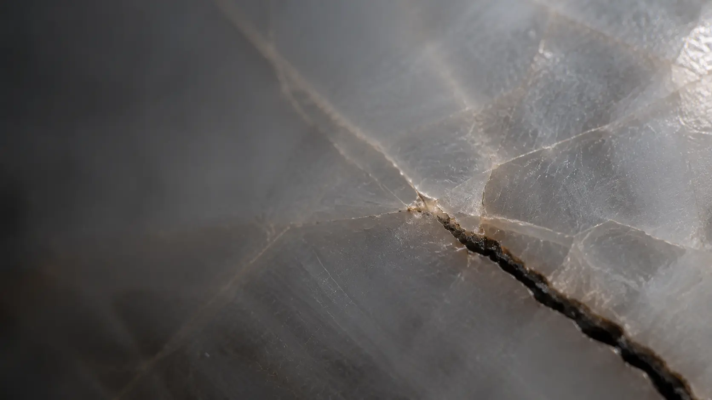

# Why Does a Crack Turn?

*A finished fracture looks prewritten. Its route formed one break at a time.*

> **Image Caption:** The material already constrains the next turn, but only one continuation has become the crack.

Look at a crack after something has broken.

The path feels inevitable.

It began here, bent there, crossed one grain, avoided another, and ended at the edge. Once the line exists, it is easy to imagine that the whole route was hidden inside the material from the beginning.

As though the crack merely uncovered a dotted line that was already waiting.

But before the crack advanced, that finished line did not yet exist.

Several continuations could be physically available. They were not equally easy. They were not unconstrained. Yet the exact route still had to form through the breaking itself.

So why does a crack turn?

## Growth is not the same as path selection

A flaw changes the mechanical problem around it.

Stress becomes strongly concentrated near a sharp crack tip. In linear elastic fracture mechanics, engineers describe that near-tip field using stress-intensity factors, often written as `K`. Crack growth becomes possible when the mechanical driving becomes sufficient relative to the material's resistance, described through fracture toughness, energy release, or related measures.

The older Griffith picture gives the basic economy: extending a crack can release stored elastic energy, but creating new fracture surface also costs energy. The crack can grow when enough energy is available to pay that cost. A [NASA fracture-mechanics primer](https://ntrs.nasa.gov/citations/19920021173) gives the ordinary engineering foundation behind this description.

That helps answer:

> **Can the crack continue?**

It does not always give one simple answer to:

> **Where will it go?**

Direction depends on more than one total threshold. Loading, geometry, the angle of the existing crack, local toughness, pores, inclusions, scratches, grains, and grain boundaries can all reshape the field around the tip.

The crack is not facing an empty future.

It is facing a field of unequal continuations.

## The route changes its own next question

Suppose the crack moves a little to the left.

That new opening changes the geometry. It releases some stress and concentrates other stress around the new tip. A route that was easy one step ago may no longer be easiest. A route that was barely available may become strongly favoured.

The crack's history has become part of its next mechanical condition.

Fast cracks make this even clearer. In experiments on brittle PMMA, Sharon and Fineberg described a [microbranching instability](https://journals.aps.org/prb/abstract/10.1103/PhysRevB.54.7128): a single moving crack can become unstable to frustrated microscopic side branches. Those branches affect roughness, energy dissipation, and later propagation.

The act of advancing can create new available routes.

Disorder matters too. A 2024 three-dimensional [phase-field study](https://www.nature.com/articles/s41467-024-51573-6) found that quenched disorder and branching instability work together to control dynamic fracture. Its computational approach allows complex crack trajectories and changes in topology to emerge without imposing a future crack line from outside.

A [2025 phase-field study](https://journals.aps.org/pre/abstract/10.1103/PhysRevE.111.055502) makes another useful separation. Changing how soft inclusions were distributed had little effect on the material's effective elastic properties, yet significantly changed crack propagation and its threshold.

Two materials can therefore look similar through a broad average while presenting different local routes to an advancing crack.

The arrangement matters.

## The finished line hides the lost alternatives

After the break, the fracture surface preserves the route that happened.

The unopened alternatives leave no matching dark line behind them.

That makes hindsight deceptive. We see one complete history and mistake completeness *after the event* for complete specification *before it*.

Phase-field models are useful here because they do not need a future crack geometry to be drawn first. An evolving damage field lets the path turn, branch, merge, or change topology through the calculation.

This does not prove that physical reality is secretly a phase-field simulation. It does not mean the crack is free to go anywhere. The equations, loading, geometry, and material structure still constrain it sharply.

The lesson is narrower:

> **A future can be strongly constrained without its detailed route being pre-rendered.**

Constraint is not the same as a script.

## The framework lens: memory without replay

This is where My GUT Deduction offers an interpretation.

It does not replace fracture mechanics, derive `K`, or claim that cracks contain intention. The physical explanation remains the physical explanation. The framework correspondence is about the structure of continuation.

The framework keeps three roles separate:

`retained history`
→ what present resolution begins from

`Aim`
→ what must still be satisfied

`resolution`
→ which finer continuation actually becomes consequential

A crack does not need an Aim in the framework's higher-order sense. Its loading and material constraints already give fracture mechanics the relevant physical bias.

What the crack makes easy to see is the relation between history and resolution.

`past resolution`
→ `coarse retained consequence`
→ `biased field of compatible continuations`
→ `new fine resolution`
→ `new retained consequence`

The existing crack is not merely an archive of what happened. Its shape is part of the present ground. It changes which routes remain supportable next.

But it does not contain a pixel-perfect drawing of the remaining fracture.

> **The past is memory, not a bind.**

Here, memory means that what happened remains consequential. Not a bind means that the consequence does not force the future to replay one exact route.

The framework calls this kind of retained structure **coarse**.

Coarse does not mean fuzzy, weak, approximate, or half-real. It means the structure has committed to the distinctions that matter without making every finer distinction in advance.

> **Coarse is committed structure without unnecessary commitment.**

That structure can exclude impossible continuations, make some routes cheaper than others, and still leave more than one finer route unresolved.

> **Article Slot:** URL: https://soutame.substack.com/p/the-possibility-lane

## One history, one step at a time

A finished crack is real history.

It is not evidence that every turn had to be fully drawn before the first break.

The crack advances from what has already happened. Each step becomes new geometry. New geometry reshapes the stress field. That field changes what can happen next.

The past remains.

The future does not begin pristine.

But neither is the future reduced to playback.

This is the useful middle between two bad pictures:

`nothing constrains the route`

and:

`the complete route already exists`

The crack shows something quieter.

Constraint can guide without pre-rendering. History can survive without becoming a cage. One resolved route can become the ground from which several new routes remain possible.

And that leaves a question larger than fracture:

> **When we see one finished history, how often do we mistake the path that happened for a path that had to be fully specified in advance?**
