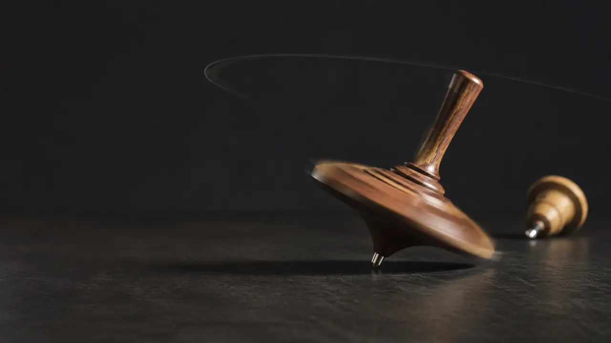

# Why Does a Spinning Top Fall Sideways?

## Gravity is still pulling it down. Spin changes what that pull can change first.

> **Image Caption:** Gravity still supplies the torque. Spin changes whether that torque first topples the axis or turns its direction.

Set a toy top on its point and tilt it without spinning. It falls.

Spin the same top quickly, give it the same tilt, and it does something that seems to ignore the obvious. Its tip remains on the table while its axis sweeps sideways around the vertical. Instead of dropping in the direction gravity pulls, the top begins to circle.

Gravity did not switch off.

The top has not found a hidden upward force.

It is falling differently because gravity is acting on something that is already in organized motion.

That is the mystery of precession. It is also a clean reminder that a cause does not arrive at an empty object. What is already happening changes what the same influence can change next.

But before the framework touches that idea, the mechanics deserves its full answer.

## Gravity produces a turn, not only a pull

Gravity pulls on the top through its center of mass. The table supports the top at the small contact point near its tip. When the top is tilted, the center of mass is no longer directly above that pivot.

That offset matters.

A force acting away from a pivot produces a **torque**: a tendency to change rotational motion. In vector form, the gravitational torque about the pivot is

\[
\boldsymbol{\tau}=\mathbf{r}\times M\mathbf{g}
\]

Here, \(\mathbf{r}\) points from the pivot to the center of mass, while \(M\mathbf{g}\) is the top's weight. The cross product means the torque does not simply point down with gravity. Its direction depends on the relation between the pivot, the center of mass, and the force.

This is the first place ordinary intuition fails. We see a downward force and expect a downward response. Rotational motion cares about the torque around a chosen point, not only the direction of the force.

Torque changes angular momentum:

\[
\boldsymbol{\tau}=\frac{d\mathbf{L}}{dt}
\]

That equation is the heart of the answer. [OpenStax uses the same tilted-top setup to explain gyroscopic precession](https://openstax.org/books/university-physics-volume-1/pages/11-4-precession-of-a-gyroscope).

## The top at rest begins near zero

Consider the tilted top before it is spun.

It begins with almost no spin angular momentum. Gravity still produces torque about the contact point, but there is no large existing angular-momentum vector for that torque to turn. The torque begins building angular momentum in its own direction.

The result is familiar: the top rotates about a roughly horizontal axis and falls over.

Nothing strange happens because there is little previous rotational state to compete with the new change. The torque can immediately build the falling motion.

Now spin the top.

The force of gravity is the same. The center of mass is still offset. The gravitational torque is still present.

But the state receiving that torque is no longer the same.

## The spinning top already has somewhere to turn from

A rapidly spinning, roughly symmetric top carries a large angular momentum \(\mathbf{L}\), directed approximately along its tilted spin axis.

During a short interval \(dt\), gravity's torque adds a small change:

\[
d\mathbf{L}=\boldsymbol{\tau}\,dt
\]

In the familiar fast-precession case, that small change is largely perpendicular to the angular momentum already present.

Imagine a long arrow pointing along the top's tilted axis. Add a very small sideways arrow to its tip. The long arrow does not suddenly point down. It points almost the same way as before, but turned slightly to one side.

Repeat that addition.

The long arrow keeps turning. As its direction changes, the geometry of the top and its gravitational torque changes with it. The sequence continues around the vertical.

That circular change in the axis is **precession**.

So the top is not resisting torque. Precession is what the torque is doing. Gravity is continuously changing the direction of the top's angular momentum.

This is why “angular momentum holds the top up” is a risky shortcut. Angular momentum is not an extra force pushing against gravity. It describes the rotational state that gravity's torque is changing. The table still supplies support at the pivot, gravity still supplies the torque, and the existing spin changes the form of the response.

> **A push does not determine a change by itself. What is already in motion matters to what the same push can change.**

## Why spinning faster can make the sweep slower

There is another result that feels backward.

For a simple rapidly spinning top in steady precession, the precession rate can be written as

\[
\omega_P=\frac{rMg}{L}
\]

and, using \(L=I\omega\),

\[
\omega_P=\frac{rMg}{I\omega}
\]

Here, \(\omega_P\) is the precession angular speed, \(r\) is the distance from the pivot to the center of mass, \(M\) is the mass, \(g\) is gravitational acceleration, \(I\) is the relevant moment of inertia, and \(\omega\) is the spin angular speed.

Within this approximation, a faster spin gives a larger \(L\). The same gravitational torque then adds the same amount of sideways angular momentum each second, but that change is small compared with the larger vector already present. It takes longer to turn the direction through the same angle.

So faster spin can mean slower precession.

Gravity has not become weaker. The incoming torque is being compared with a larger existing rotational state. OpenStax states the important condition explicitly: this simple result assumes the precession rate is much smaller than the top's spin rate. It is a fast, steady-precession approximation, not a complete equation for every top.

## Real tops do more than draw clean circles

A real top rarely begins in perfect steady precession. Its axis may bob up and down while it sweeps around. That extra motion is called **nutation**.

The contact point is not perfectly frictionless. The top also pushes air aside. Energy is dissipated, the spin slows, the contact may slip, and the assumptions behind the neat formula become less accurate. The axis can wobble more strongly, the body descends, and eventually the top falls.

A spinning top does not escape falling forever.

It spends part of its fall changing direction.

The same effect can be felt with a bicycle wheel held by its axle. Spin the wheel, then try to turn the axle. The response appears in a direction that your hands may not expect because your torque is changing an existing angular-momentum vector.

That is a useful tactile demonstration. It is not a complete explanation of why a moving bicycle stays upright. Steering geometry, contact forces, the bicycle's design, and the rider's response also matter. A memorable example should not be promoted into a full theory.

## What the top makes visible

At this point, ordinary mechanics has answered the title question.

The framework is not needed to calculate the precession. It does not improve the equation in this article. It enters only because the top makes one broader structure unusually easy to see:

> **A new relation resolves against accumulated ground, not against an empty page.**

My GUT Deduction treats present information as accumulated constraint. A relation that has already seated can become ground for what resolves next. The present does not erase its structure and restart from zero whenever something new happens.

The tilted top at rest and the tilted spinning top receive the same kind of gravitational interaction. But they do not present the same current state to it. One begins near zero spin angular momentum. The other begins with a large organized rotational state. The next change is therefore different.

In mechanics, angular momentum gives that state a precise quantitative description. In the framework, the top is only an analogy for the more general claim that what arrives is resolved through what is already there.

That distinction must stay firm.

Angular momentum is not computational budget. Torque is not a framework Cut. Spin is not automatically a Lane. The measured angle of the top is not automatically the framework's deeper relational orientation. Nothing here derives rigid-body dynamics from the framework's primitives.

The top simply shows why this sentence is too weak:

“Gravity makes the top move.”

A better sentence is:

“Gravity's torque changes the rotational state the top already has.”

Or, in the broadest plain language:

> **What arrives matters, but what it arrives to matters too.**

## Is that a prediction?

Not yet.

In this Bit, the framework is noticing a structural pattern already described completely by classical mechanics. It is not predicting a new precession rate, explaining a measurement that mechanics cannot explain, or deriving \(\boldsymbol{\tau}=d\mathbf{L}/dt\) from more primitive relational rules.

For the connection to become more than an interpretive lens, the framework would need a quantitative bridge. It would have to derive angular momentum, moment of inertia, torque, and the equations of rigid-body motion, then recover the successful measurements without importing those results under new names.

That debt remains open.

Still, the lesson is useful because causal language often makes the arriving influence sound like the whole cause. Push here, move there. Pull down, fall down.

The top refuses that simple picture in full view.

Gravity keeps pulling downward. The top keeps answering sideways for a while—not because the past has vanished, but because the present spin is part of what gravity is acting on.

When the same push produces a different change, how much of the cause belongs to what arrived, and how much belongs to the state that was already there?
