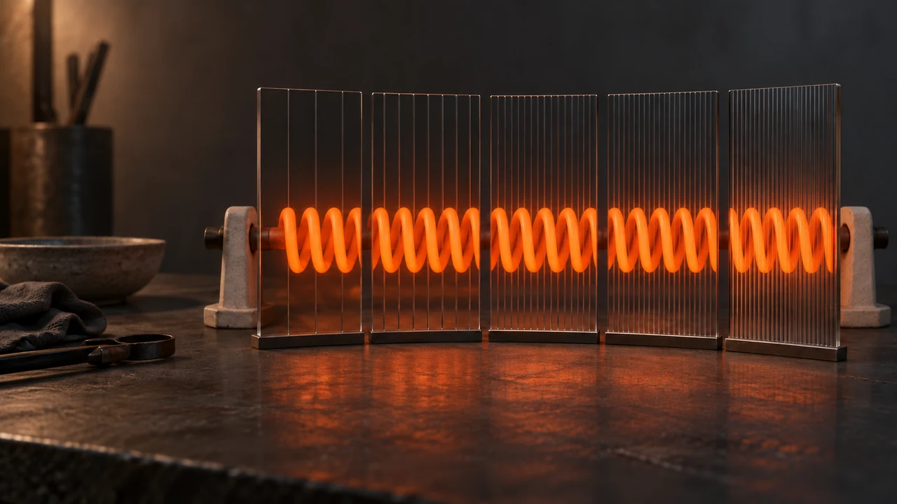
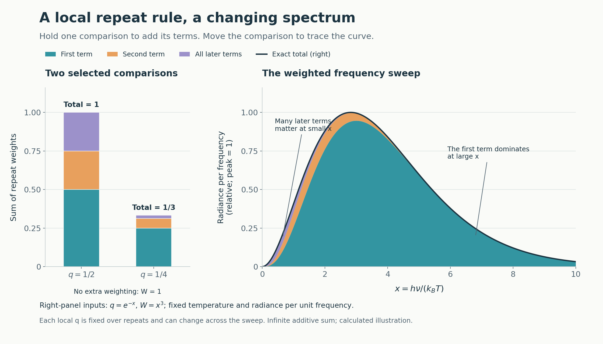

# Why Does Heat Draw a Curve?

*One comparison gives a contribution. A changing comparison traces the spectrum.*

> **Image Caption:** One thermal source, a changing range of comparison. The windows are a visual metaphor for selecting different grains; they are not a proposed instrument or experimental evidence for the framework.

A heating element can be giving off radiation while it still looks dark.

A thermal camera can already detect its infrared emission. Keep heating it and a visible glow appears. Our eyes have started catching part of what the element emits. [NASA's introduction to infrared shows this distinction between warm objects and visible glowing.](https://science.nasa.gov/ems/07_infraredwaves/)

But the glow hides a question.

Imagine holding the element at a steady temperature and measuring its radiation through a sequence of narrow frequency ranges. How much arrives here? Then here? Then a little further along?

For the clean ideal thermal case, the readings rise, reach a peak, and fall. They do not give one isolated colour, and they do not give every range an equal share.

Why that shape?

Start with an ideal blackbody in thermal equilibrium. It absorbs incident radiation completely. A small opening into a cavity held at one temperature approximates it: incoming radiation is trapped and absorbed, while escaping radiation approaches the equilibrium spectrum. Temperature sets the ideal distribution. [NRAO develops this physical setting.](https://www.cv.nrao.edu/~sransom/web/Ch2.html#S4)

An actual heating element brings its material response too. Its efficiency of emission can vary with wavelength. NIST measures that property by comparing a sample's spectral radiance with a blackbody reference. Two surfaces at the same temperature need not give identical spectra. [The reference and the material response have separate jobs in that measurement.](https://www.nist.gov/laboratories/tools-instruments/system-infrared-spectral-emittance-materials)

The blackbody is useful because it gives us a precise case to understand before adding those differences.

In the standard explanation, three things meet. There are available radiation modes: possible patterns of the field. Each photon carries energy proportional to its frequency. And thermal equilibrium determines the average occupation of the modes. Higher frequencies offer more modes per equal frequency interval, but their larger energy steps become harder to occupy at a given temperature. Eventually that suppression wins, and the spectrum falls. Planck's law quantifies the balance. [NRAO gives the mode counting and thermal derivation.](https://www.cv.nrao.edu/~sransom/web/Ch2.html#S4.SS2)

So physics already answers the opening question. The rise and fall express a changing balance between available modes, energy, and occupation across frequency.

There is also a small measurement detail that matters more than it first sounds.

A spectrum has a horizontal coordinate and a rule for how much interval each reading represents. Suppose we collect radiation from 1 to 2 micrometres, then from 2 to 3 micrometres. Both wavelength bins are one micrometre wide. Using the rounded speed of light, the first spans about 300 to 150 terahertz; the second spans about 150 to 100 terahertz. Their frequency widths are 150 and 50 terahertz.

Equal wavelength buckets can cover very unequal frequency ranges.

To preserve the same amount of radiation in matching intervals, the density must include that width conversion. Consequently, a plot per unit wavelength can peak at a different place from a plot per unit frequency. Relabelling the horizontal axis alone is insufficient. [MIT's notes show the factor connecting the two Planck densities.](https://ocw.mit.edu/courses/12-815-atmospheric-radiation-fall-2006/a4ea2da52e05800b5782a91b96f54322_thermo.pdf)

That is a change in accounting. Changing a graph's buckets does not create radiation in the element.

Now we can make the framework's question precise enough to be useful.

Could a repeated relational operation supply a rule for the contribution at each selected comparison, with the changing comparison producing the whole spectrum?

The framework calls the selected level of distinction a **grain**. Here, that means which periodic distinctions the encounter requires. A broader grain can still be a definite, supported relation. It need not be a blurred version of a finished fine picture.

In the proposed account, the receiver and target meet at a selected grain. The contribution depends on that relation and on the support that remains consequential to it. Move through a range of grains and the supported result can change. Measured frequency is the physical label that this candidate account must eventually recover from the comparison.

This is a proposal about the encounter itself. It does not require a human watching, or a detector whose settings can dictate any answer it likes.

Before giving the operation a formula, try two ordinary sums.

At one selected comparison, suppose each further contribution has half the weight of the previous level. Starting with a first weight of one-half, we get:

`1/2 + 1/4 + 1/8 + ... = 1`.

Now move to a different comparison. Its local factor is one-quarter:

`1/4 + 1/16 + 1/64 + ... = 1/3`.

Both use repeated proportions. Their totals differ because the selected comparison supplies a different proportion.

So when we say the factor is constant, what is being held still?

**The factor stays fixed while we add repeats at one selected grain. The grain can then change, and its local factor can change with it.**

There are two movements here. Moving along the sum asks what the next repeat contributes. Moving along the spectrum asks which comparison we are summing at.

We can hold the first rule steady locally while the second moves continuously. There is no need for one universal multiplier across the entire curve.

The fractions are model weights. They are not measured absorption probabilities or pieces of a photon. Identifying what physical relation supplies them is part of the proposed mechanism.

For the simple calculation, assume that the contributions are nonnegative and additive, that the first is weighted by `q`, and that every further repeat has the same factor `q`, with `0 < q < 1`. Let the idealized sequence continue indefinitely. Then:

$$
q+q^2+q^3+\cdots=\frac{q}{1-q}.
$$

The familiar exponential enters through a change of notation. Define `chi = -ln(q)`. Then `q = exp(-chi)`, and:

$$
\frac{q}{1-q}=\frac{1}{\exp(\chi)-1}.
$$

That equality is exact. The minus one follows from the continuing proportional sum.

The exponential describes how successive terms depend on the repeat index. It has not yet told us how the selected grain determines `chi`, or why `chi` should equal a measured frequency divided by a thermal scale.

The same caution applies to a shrinking-length picture. If a scalar length changes proportionally to its current length, integrating a specified proportional rate gives an exponential of accumulated change. A varying rate can go inside that accumulation. Choosing the base `e` does not choose the rate, identify an outside clock, or establish that length contraction and spectral occupation are the same operation.

The useful result is narrower and more concrete: a local proportional repeat rule supplies this denominator. A separate weighting still has to specify what the observable counts.

For the conventional Planck frequency shape, let `x = h nu/(k_B T)`, where `nu` is frequency, `T` is absolute temperature, `h` is Planck's constant, and `k_B` is Boltzmann's constant. At fixed temperature, removing the dimensional prefactor leaves:

$$
S_\nu(x)=x^3\left[e^{-x}+e^{-2x}+e^{-3x}+\cdots\right]
=\frac{x^3}{e^x-1}.
$$

Here we have supplied two conventional inputs: `chi = x` and the weighting `x^3`. In ordinary physics, mode counting supplies two powers of frequency and energy per photon supplies the third. In the framework construction, those physical identifications remain to be derived.

> **Image Caption:** Calculated illustration. Left: unweighted sums at local ratios of one-half and one-quarter. Right: the conditional Planck shape per unit frequency at fixed temperature, using the conventional inputs `x = h nu/(k_B T)` and `x^3`, normalized to a peak of one. Colours separate mathematical terms. They are not measured components, individual colours of light, or physical layers.

This is more informative than merely drawing a hump that resembles a thermal curve. The sum reproduces the stated shape exactly under its inputs. It also lets us see which terms matter where.

At small `x`, the local factor is close to one. Later terms diminish slowly, so many repeats contribute. At large `x`, the factor is small. Later terms disappear rapidly and the first carries nearly the whole response. The weighting and the repeat sum together determine the rise, the peak, and the tail.

But the repetition assumption must stay attached to the result.

If the factor changes between repeats at the same grain, the weights become `q_1`, then `q_1 q_2`, then `q_1 q_2 q_3`, and so on. Each term contains the product of the factors actually encountered. Their sum need not have the simple denominator above.

And additive weights cannot silently replace coherent wave amplitudes. Phase relations and interference must be accounted for whenever they matter. Piling sine waves together to draw an instantaneous waveform would answer a different question from the spectral distribution considered here.

There is a useful way to test what this rule contributes. Keep the conventional inputs, but stop the mathematical sum after `N` terms.

Far enough toward small `x`—specifically, when `x` is much smaller than `1/N`—each retained exponential is close to one. There are only `N` of them, so the weighted response approaches `N x^3`. With the infinite sum, the low end instead approaches `x^2`.

Stopping the sum changes the low-frequency rise. It is not merely a brightness adjustment. At large `x`, both versions are still dominated by the first term.

That is a diagnostic within the model. It does not show that physical radiation has a finite repeat cutoff, and finite resolving capacity does not by itself establish such a cutoff. The repeat index has not been identified with a count of separately rendered physical events.

The distinction between shape and calibration matters too. One constant can raise or lower a curve without changing its shape. Changing the grain dependence of the weights can change the shape itself. Changing spectral bins adds its own conversion: per logarithmic frequency interval, the conventional numerator becomes `x^4`. A constant multiplier cannot replace those operations.

The framework's comparison also has to keep its support attached. Target, receiver, and any anchor relation that changes the result belong in the comparison. Truly common factors may cancel. Support that distinguishes the two sides cannot disappear into shorthand. Its budget means resolving capacity; it is not another name for heat, photon energy, or clock time.

This leaves a specific piece of work to do. The algebra is available. The candidate is that supported repeated resolution supplies the weights. A native physical account must identify those contributions and recover the argument, frequency weighting, absolute normalization, and scaling between differently supported grounds. The older square-root toy remains a separate illustration; this sum does not retrospectively turn it into Planck's law.

That status is the one preserved in the [current spectrum source and its grain-sweep extension](https://github.com/lenkunz/universe-made-of-logic-framework-publish/blob/main/source/changes/2026-09-06-grain-sweep-and-repeated-comparison.md).

The related cooling question comes afterward: how does the spectrum compare when the participating grounds change? That is the question carried by the CMB episode.

> **Article Slot:** URL: https://soutame.substack.com/p/the-cmb-is-losing-the-resolution

Return to the heating element, held steady while we work through its radiation.

Each point on the graph belongs to a selected range and a declared way of counting. Under the candidate repeat rule, one comparison lets many terms matter; another leaves almost everything to the first. Moving through the range gathers those different outcomes into one curve.

The glow now carries a more precise question: what rule determines the contribution here, and how does that rule change when the comparison moves?

**The sweep makes the curve. The continuation rule gives it a shape.**
