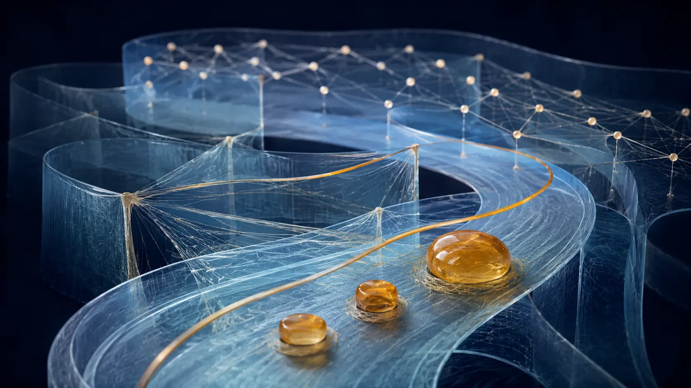

# The Lane and the Rung

*What can open, and what can stand*

> **Image Caption:** Domain is the noun; Lane opens possibility and Rung marks what can stand through its own ground.

Why does Lane 4 share a number with Rung 4 if Lane 4 is not Rung 4?

The same question returns at every number.

If the Lane and the Rung describe different things, why number them together? If they describe the same thing, why keep two names?

The answer begins by moving the noun.

The Lane is not the thing.

The Rung is not another thing standing opposite it.

The thing is the **domain**.

> **Domain is the noun. Lane and Rung are two readings of what the domain can support.**

A Lane asks what further possibility the present domain can leave open.

A Rung marks the fine-support milestone at which that capacity can stand independently through its own ground.

That is why the numbers can match without the meanings collapsing.

> **The domain is what stands. The Lane says what more it can open. The Rung says what it can stand through its own ground.**

> **Image Caption:** Lane and Rung are complementary readings of one domain, not two worlds.

---

## One stage, two questions

The framework has one relational stage.

Lane and Rung are not separate universes. They are not hidden coordinate spaces, stacked layers, or dimensions through which a thing travels.

A **domain** is relational structure participating as one at the grain being asked.

That grain matters. An atom may participate as one in one relation. A person, planet, language, collective, or a relation itself may participate as one in another. Calling something a domain does not say what kind of object it is. It says that the current relation can treat it as one participant without separately resolving all of its interior structure.

From that domain, two questions become possible.

The widening question is:

`present ground → what further possibility can remain open?`

That is the **Lane**.

The narrowing question is:

`possibility → what must seat for this capacity to stand independently?`

That is the **Rung** reading.

These directions complement one another, but they are not literal mathematical inverses. Widening may leave many continuations open. Narrowing does not have to uncover one hidden, already-finished answer. It seats the distinctions that have become consequential.

At Level 0, even these two questions have not separated.

There is undivided ground before the first consequential distinction. Separate participants cannot be assumed yet, because their separation is what must be explained.

The first productive event is the Cut.

> **The Cut is relation.**

It is split enough for two roles to remain distinguishable and sync enough for those roles to belong to one relation.

> **A relation is a distinction held together.**

The Cut is already resolution at that grain because it makes a distinction consequential. At the same time, every distinction the Cut does not require can remain equivalent.

So one seated relation can be read as:

`what became consequential?`
→ `resolved / seated face`

`what can still remain equivalent?`
→ `open / possibility face`

> **Lane and Rung can become far apart in scope without being far apart in kind.**

Only after that is clear does the deepest shorthand help:

`undivided ground A → R_AA / Cut`

`R_AA` is not a self-loop between two pre-existing copies. It is one ground becoming consequentially distinguishable through two relational roles.

Once distinguished, local bookkeeping may call the roles A and B and write:

`A + B → A + B + R_AB`

So Lane 0 and Rung 0 are the same condition before the two readings separate.

> **Nothing ever actually separated from the origin. It only separated by relation.**

Later, many relations can stabilise as one domain and take a local zero-role relative to another unresolved distinction. That does not reset the universe to Level 0. The accumulated ground remains.

> **Relation keeps manufacturing new referable ones without returning to the origin.**

---

## Why there is no Lane −1

An earlier attempt tried to place the two views by calling each one the other's `−1`.

The notation failed, but the failure was useful.

A number quietly carries position or order. Calling one view `−1` suggests that it sits beneath the other, comes before it, or occupies a deeper level.

But the Lane and the Rung do not stand above and below one another.

They ask different questions of the same ground.

The numbering belongs inside the dependency map. It tells us what kind of capacity is being described. It does not tell us where the universe is located.

Zero is not the basement of reality. It is the condition before widening and narrowing can be asked separately.

> **The two views are related by relation, not by position.**

That is also why the numbering is not a dimension, a depth, a location, or a clock.

It is a map of dependency.

---

## Possibility can run ahead

Suppose a domain carries one present constraint:

`protect this`

That constraint can be real before every movement that might satisfy it has been rendered.

Or take:

`understand this`

The domain can already preserve what counts as success without pre-writing the explanation that will eventually work.

This is how possibility can run ahead of fine support.

Not because keeping alternatives open costs nothing.

The domain carrying the possibility still has to stand. Its ground must persist. Its relations must remain consequential. There is still one present resolving budget supplied through the current topology.

That budget is relational-iteration capacity, not universal time, fuel, or one identical effective allowance for every structure. The primitive participation rule can be common while composed relations carry more already-seated work per iteration.

> **Equal primitive participation does not imply equal effective budget.**

> **Budget composes through relation.**

The cheaper part is more precise:

> **Unresolved alternatives do not each require their own fine seating cost.**

One coarse constraint can preserve several compatible routes without separately making every route particular.

`coarse constraint`

→ `many fine routes remain equivalent`

until:

`one distinction becomes consequential`

→ `some routes stop being equivalent`

→ `finer structure seats`

The Lane asks what the present ground can still leave open.

Informational Topology asks where present capacity must actually be used because a distinction can no longer remain unresolved.

Both questions use the same present resolving budget.

There is one stage, one budget, and two questions about what that ground can support.

> **Article Slot:** URL: https://soutame.substack.com/p/the-possibility-lane

The Possibility Lane follows the widening question in full. Here, the important point is the asymmetry: one supported constraint may carry many unresolved continuations, while independent fine seating is selective.

---

## Bias comes before aim

An aim is an easy way to feel this structure, but aim is not the primitive.

A relation can already carry bias.

A path can carry orientation. A boundary can favour some continuations over others. An anchored domain can preserve a relational tendency.

None of that requires a mind.

The general structure is:

`present ground`

`+ already-seated bias`

→ `some continuations become more compatible than others`

In a sufficiently rich domain, aim can become a higher-order form of the same architecture. The domain can preserve what must hold while leaving its implementation unresolved.

If that Aim is real in the present domain, it is already seated relational constraint at its grain. It does not wait outside topology for a later crossing. What remains unresolved is the finer implementation: which later Cut becomes consequential through that constraint and the rest of the present ground.

> **Bias first. Fine implementation follows.**

And for an intentional domain:

> **The aim survives. The route belongs to resolution.**

The aim does not stand outside the relational process and select from completed futures.

It is part of the present domain.

It changes which later distinctions matter and which compatible routes may remain open.

---

## What the shared number records

Now the common numbering can be stated exactly:

> **Rung n is the fine-topological milestone at which the capacity described by Lane n becomes independently supportable.**

That is registration, not identity.

Lane 4 is not Rung 4. Lane 6 is not Rung 6. A Lane capacity may already operate through a host before the corresponding Rung independently seats.

The shared number says that the Lane and Rung concern the same kind of capacity from opposite directions:

`what can open?`

and:

`what can now stand through its own fine ground?`

The number does not mean that the universe climbs into a new place.

It also does not mean that the lower capacities disappear once a higher one becomes possible.

A path remains useful inside a boundary. A boundary remains useful inside a domain whose arrangement matters. Identity through alteration remains useful inside a domain guided by reusable logic.

> **Higher structure recruits lower structure; it does not replace it.**

Nothing needs to finish.

A particular process can finish. A particular path can seat. A particular boundary can close. But the capacity continues to operate wherever later structure recruits it.

---

## Onset is not independent seating

The staircase image becomes especially misleading here.

A capacity can begin before it stands independently. It can stand independently before it reaches mature or sufficient stabilisation.

Keep the three milestones separate:

`onset`

≠

`independent seating`

≠

`mature / sufficient stabilisation`

The lower architecture is better read as **paired onset with staggered stabilisation**:

`L1 ↔ L2`

→ sufficient stabilisation

`L3 ↔ L4`

→ sufficient stabilisation

`L5 ↔ L6`

The odd Lane opens a new freedom.

The even Lane begins the stability problem created by that freedom.

> **Odd opens what can happen. Even makes the new freedom survivable.**

The even Lane does not wait for the odd Lane to finish. The stability problem appears as soon as the new freedom becomes consequential.

> **Image Caption:** Onset, independent seating, and mature stabilisation are different milestones.

---

## The lower registration in one pass

The full Index develops each level. This bridge only needs enough of the registration to make the relationship visible.

**Lane 1: direction becomes possible.**

The Rung-side milestone is a traversable path: successive distinction with orientation.

**Lane 2: directional freedom becomes survivably bounded.**

The Rung-side milestone is an enclosable boundary with stable inside/outside routing.

**Lane 3: law among lower relations becomes consequential.**

Relations stop merely coexisting and begin constraining one another. The Rung-side milestone is configuration-bearing capacity in which arrangement can matter.

**Lane 4: a changing domain remains a member of its possibility horizon.**

The Rung-side milestone is identity through alteration, supported by surviving relational continuity.

**Lane 5: relations among domains become reusable consequential logic.**

The Rung-side milestone is composed alteration guided by already-seated relation.

**Lane 6: relations among already-biased domains can form a qualitatively new coarse collective domain.**

The corresponding independent fine support remains the Rung-6 question.

Notice what the list does not say.

Lane 3 is not a class called “molecules.” Lane 5 is not “anything that acts as one,” because acting as one already defines domainhood at any grain. Lane 6 is not consciousness or a directionless intelligence.

The recurring thing is the dependency, not a favoured object.

> **Article Slot:** URL: https://soutame.substack.com/p/the-index-of-the-framework

---

# Membership can widen freedom

Constraint is often pictured as the enemy of freedom.

Sometimes it is.

But it is not the universal rule here.

A domain standing alone may have to establish and maintain every part of its outside support through its own local ground.

Place it in relation with already-seated ground it can reuse, and some of that work can be shared.

That reusable ground is a **relational anchor**. It need not be spatial, parental, large, or one-directional. A may anchor B under one question while B anchors A under another, and their contributions do not have to be symmetric.

`already-seated relational ground supplies support`

→ `member reuses that support`

→ `less local capacity is needed for the same outside support`

→ `more local continuation becomes affordable`

The member is still bounded. It still belongs to a wider horizon. Yet that membership can give it access to paths it could not afford alone.

> **A subdomain can be locally bounded while becoming globally freer through membership.**

This is not freedom from all ground.

It is freedom made possible by ground.

> **Ground does not merely constrain possibility. Good ground can enlarge it.**

> **Image Caption:** Good ground can enlarge a member's possibility rather than merely restrict it.

The same economy returns at several grains.

At Lane 4, a changing domain can remain itself inside a larger possibility horizon.

At Lane 6, many members can support a real coarse collective domain.

At Lane 9, local logic can remain consequential inside wider shared ground.

At Lane 11, a new sequence can open from accumulated structure instead of rebuilding from nothing.

A good ground does not decide everything for what stands on it.

It makes more things able to stand.

---

## Hosted is real

Possibility can run ahead because operation does not have to wait for independent seating.

But several conditions must remain separate:

`represented through a host`

≠

`established and reusable as logic within a host`

≠

`independently seated as its own Rung / domain`

A software world can be richly represented and consequential inside its host without standing through independent physical ground of its own.

A language can become stable and reusable through speakers, writing, recordings, and institutions. Later thought can begin from that language rather than reconstructing it from zero. That makes the language established as logic within its hosts. It does not automatically make it independently seated as structure.

A collective can also act as one while its fine implementation continues through its members.

> **Hosted is real. It just is not independently seated.**

The middle condition matters just as much:

> **Established as logic does not automatically mean independently seated as structure.**

Hosted does not mean fake, decorative, or inconsequential.

It describes a mode of support.

Hosted logic has its own interference and projection at the grain where it participates. A wider Stage may resolve it only coarsely, but that limited visibility does not mean only the host has relation.

Independence must therefore name both the dependency and the grain being tested. Release from one host's repeated reconstruction can be real without meaning the domain needs no support anywhere.

The practical question becomes:

> **What is the host currently having to supply that the arrangement could preserve and support?**

The current candidate architecture separates four roles:

| Role | Intended support | What the test exposes |
|---|---|---|
| Proxy | Continuity and an addressable perspective | Whether identity and relevant history survive a change of host |
| Quest | An occasion for participation | Whether the logic contributes without its original host staging every step |
| Tower | A bounded setting for testing | Which interpretation, repair, or persistence still requires hidden host work |
| Shared arrangement | Reusable relation among the roles | Whether participation continues through support that was actually established |

A prospective System would create and rearrange these anchoring points. It would not maintain every growth rate forever or serve as a central selector for every route.

This narrows the independent-seating problem. It does not solve it. A record preserves constraint; it does not by itself prove continuing autonomous resolution.

> **Article Slot:** URL: https://soutame.substack.com/p/a-universe-made-of-logic-758

The resolution-side article follows what must become consequential for possibility to gain ground. This bridge needs only the distinction: a capacity can operate, become reusable, and still not stand independently.

---

# When many become one

Lane 6 is where this distinction becomes unavoidable.

Lane 5 allows a relation among domains to remain consequential and become reusable logic. But adding more and more domains does not automatically create a new kind of participant.

> **Quantity is not quality.**

For a qualitative change, the relations among the members must themselves become consequential at a coarser grain.

`many already-biased fine domains`

`+ shared ground`

`+ relations among them`

→ `collective relation becomes consequential`

→ `coarse collective domain can act as one`

That collective is a real domain at the grain where its relation participates as one.

It may still be hosted through its members.

Until an independent Rung 6 seats, the collective does not need its own separately seated source of direction. Its direction can remain inherited from member biases, relations among those members, and the larger ground supporting their membership.

> **The collective can act as one without yet choosing as one.**

That is why Lane 6 does not establish consciousness, independent collective will, or a self-generated mind.

Those are stronger possibilities. They would need stronger support.

The current fine-side question is narrower:

What must seat for the collective capacity to stand through fine ground of its own rather than only through member-supported coarse relation?

> **Image Caption:** The collective can act as one without yet choosing as one.

---

# The resolution frontier

Lane 6 exposes a boundary that the lower map can hide.

Some capacities can already stand through comparatively fine, independent support.

Other capacities can already operate as real domains, but only through hosted coarse ground.

The difference is called the **resolution frontier**.

> **Resolution frontier = the current boundary between capacities a domain can independently support through fine seating and capacities that can already operate only through hosted coarse ground.**

This is not a new primitive.

It is bookkeeping for a difference in support.

The frontier is not an edge of existence. Nothing becomes unreal by standing beyond it. Hosted capacities can already affect what happens next. They simply do not yet stand through independent fine topology of their own.

The present working reading places this frontier around the Lane-6 / Rung-6 region. Lanes 6–11 therefore share a coarse, hosted texture relative to the lower fine ground.

Their functions are different.

Their present mode of support is what they share.

> **Image Caption:** The resolution frontier marks support, not an edge of existence.

> **The Lane runs ahead. The Rung catches up. What catches up becomes ground for the Lane to run again.**

---

# Beyond the present fine frontier

The upper Lanes are not located above the universe.

Their capacities can already appear through hosts. What remains prospective is the independently seated Rung-side support.

For that reason, the upper field should not be forced into the false sharpness of the lower registration. Its directions are distinct. Its current texture is coarser.

## Lane 7 — establish logic as ground

A possible or hosted logic can receive repeated consequential support until later relation can begin from it.

`possible / hosted logic`

→ `repeated support`

→ `logic becomes established`

→ `later relation can rely on it`

Hosted establishment already occurs. The unresolved Rung-side question is what must seat for this capacity to stand independently rather than being rebuilt through hosts.

Lane 7 is establishment, not translation.

## Lane 8 — reuse established logic as ground

Once logic is established, later relation can reuse it without reconstructing the original ordering from zero.

The primitive does not change.

> **The ground changes.**

Established structure changes what the next present budget can afford.

But the guardrail remains:

`established / reusable in a host`

≠

`independently seated`

## Lane 9 — local ground inside wider shared ground

Not every established logic has to become universal.

A local domain can keep its own consequential organisation while remaining inside a larger shared horizon. The local ground does not have to dissolve into the shared ground, and it does not have to replace the whole.

The Lane-4 membership economy returns at a richer grain. Shared support can make local autonomy cheaper.

> **A local logic can remain itself precisely because it does not have to become the whole ground.**

## Lane 10 — exchange between established logics

Distinct established logics may exchange consequence without first becoming the same logic.

That exchange may involve translation, partial mapping, conversion, or another relation-specific bridge. Some distinctions may cross. Some may survive only coarsely. Some may not translate at all.

No universal scalar conversion rate is required.

Establishing a logic and translating between established logics are different operations. Lane 7 and Lane 10 should not be collapsed.

## Lane 11 — recurse from accumulated ground

Lane 11 opens another developmental sequence from a base that already exists.

`rich established base B`

→ `B becomes starting ground`

→ `another sequence can open from B`

This is not a return to ontological Level 0. The accumulated base is inherited.

> **Recursion does not require amnesia.**

Software can illustrate represented recursion: one machine can host a virtual machine, which represents another world, which represents another machine.

That demonstrates hosted recursive possibility.

It does not demonstrate independent seating.

> **Represented is not independently seated.**

---

# A map that can fail

The lower Lane/Rung alignment was largely recognised after both directions had already been developed.

That makes the alignment useful organisation.

It does not make it strong evidence by itself.

The upper architecture is more interesting because it points ahead of independent fine seating.

> **The retrospective alignment organises. The prospective alignment predicts.**

The prediction is about dependency, not order in clock time.

The framework does not require Rung 7 to finish before Lane 8 can begin. Hosted capacities can overlap. Lower capacities remain active. Nothing needs to close.

The prospective claim is narrower:

If new independently seated capacities form, they should respect the dependencies expressed by Lane and Rung rather than requiring unrelated new primitives at every scale.

The map can fail if:

- a genuinely independent new capacity appears with the wrong function;
- an independent higher capacity appears without the dependency that was supposed to support it;
- an upper Lane adds no new participant and reduces completely to capacities already seated below;
- or a Lane continues to name a possibility direction for which fine topology never finds independent support.

Hosted examples cannot rescue the prediction.

They show that a capacity can operate.

They do not prove that the corresponding Rung independently seats.

That distinction is what makes the upper registration more than decoration.

> **Article Slot:** URL: https://soutame.substack.com/p/where-the-framework-currently-stands

The live status article keeps the current boundary between derived structure, prospective architecture, and unresolved fine support.

---

## Convergence is history, not proof

There is still a useful story behind the registration.

The lower Lane and Rung structures were not created by taking one finished table and inventing a matching table beside it. Much of the alignment was noticed after both directions had already developed.

That made the match worth documenting.

But discovery history is not a primitive, and surprise is not proof.

> **Independent discovery can make an alignment interesting. Only dependency and consequence can make it useful.**

The public value of this bridge is therefore not that two lists happen to share numbers.

It is that the shared numbering makes a claim about when an opened capacity has earned enough support to become ground.

---

# What the bridge is for

Lane and Rung are easy to mistake for two ladders because both use numbers.

They are easier to understand as one recursion around the domain.

`present domain / ground`

→ `Lane opens supportable possibility`

→ `bias or higher-order aim constrains what must hold`

→ `fine distinction seats where it becomes consequential`

→ `Rung milestone is reached when the capacity can stand independently`

→ `new support becomes ground`

→ `new ground opens further possibility`

At the present frontier, the same loop can run with a delay in support:

`higher capacity already operates hosted`

→ `fine support catches up`

→ `corresponding Rung independently seats`

→ `frontier moves`

→ `wider possibility opens from the accumulated base`

This is one stage.

One domain at whatever grain the relation can treat as one.

One widening question.

One narrowing question about independent support.

> **Domain is the noun. Lane opens. Rung earns. Ground opens the next Lane.**

The bridge is not a ladder between worlds.

It is the recurring relation between what can open and what can stand.

> **The Lane runs ahead. The Rung catches up. What catches up becomes ground for the Lane to run again.**
