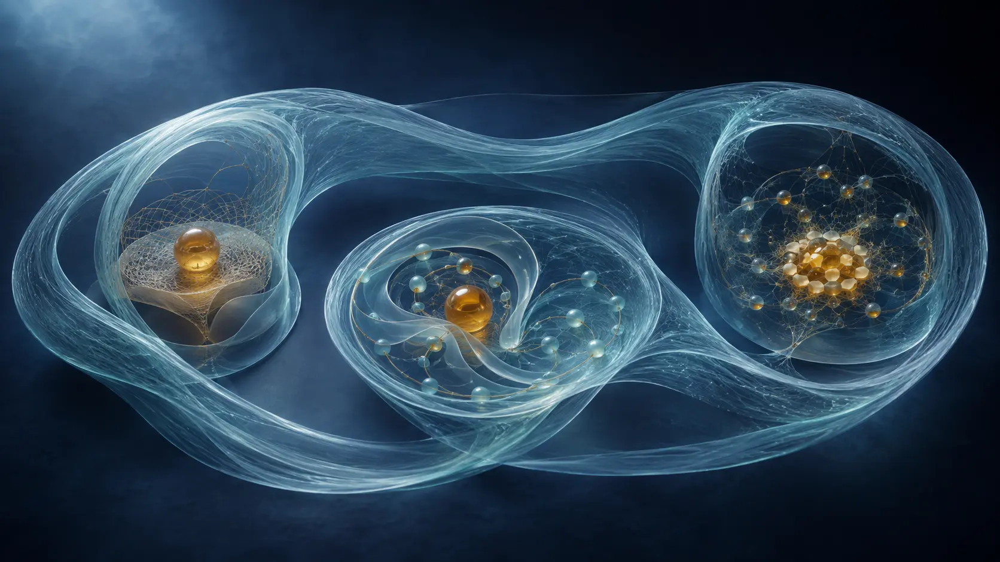

# The Possibility Lane

*What existing ground leaves open—and why possibility can run ahead of the route that will eventually make it particular.*

<!-- Image Caption: Possibility can widen from established ground before one fine route becomes consequential. -->

There are two ways to look at an unfinished possibility.

One is to ask what it would take for that possibility to become real in a particular way. What distinctions would have to matter? What relations would have to seat? What new ground would have to stand?

That is the narrowing question:

`possibility → ground`

The other way is to begin from what already stands and ask what it leaves open. How many continuations can remain available? How much can change without breaking the ground beneath it? Can a direction be real before its route exists?

That is the widening question:

`ground → possibility`

The Possibility Lane follows the second direction.

It begins with ground and walks outward.

<!-- Image Caption: Widening possibility and narrowing support are two readings of the same relational stage. -->

These are not two worlds. They are not competing explanations. They are two questions asked of the same relational stage.

**A Universe Made of Logic** follows possibility toward the fine distinctions required for it to stand. This article turns around and asks what can remain open before those distinctions are required.

<!-- Article Slot: URL: https://soutame.substack.com/p/a-universe-made-of-logic-758 -->

The difference matters because a possibility does not need to arrive as a finished hidden world.

An Aim can already be resolved as a present constraint while its finer route remains unresolved.

That is where the Lane begins.

But the shared stage begins one step deeper.

## Before ground can open possibility

The framework does not start with two separate objects waiting to be connected.

It starts with undivided ground.

The first consequential difference is the **Cut**. Yet the Cut does not happen outside relation.

> **The Cut is relation.**

It is split enough for two roles to remain distinguishable and sync enough for those roles to belong to one relation.

> **A relation is a distinction held together.**

The Cut is also already resolution at that grain. It makes one distinction consequential while leaving every distinction it does not require equivalent and open relative to the new ground.

`what the Cut distinguishes`
→ `resolved ground`

`what the Cut leaves equivalent`
→ `open possibility`

> **Every seated relation has a resolved face and an open face.**

Only after that intuition is clear does the deepest shorthand help:

`undivided ground A`

→ `R_AA / Cut`

→ `two distinguishable relational roles`

`R_AA` does not describe an ordinary self-loop between two finished copies. It describes one ground becoming referable through a difference within itself.

Once the roles are distinguishable, ordinary bookkeeping may call them A and B:

`A + B → A + B + R_AB`

That equation remains useful at every later grain where A and B are already referable. It is local bookkeeping, not the origin story.

> **Nothing ever actually separated from the origin. It only separated by relation.**

Later, many relations can stabilise enough to participate as one domain. That domain can become local starting ground for another distinction without returning the universe to Level 0.

> **Relation keeps manufacturing new referable ones without returning to the origin.**

---

# Part I — Possibility can run ahead

## Ground does not decide everything

Suppose some relational ground already exists.

It may support more than one continuation without yet needing to distinguish among them. Those continuations are not all secretly rendered in full. They remain equivalent wherever the present ground has no reason to separate them.

Then something changes. One distinction becomes consequential. Several formerly equivalent continuations are no longer interchangeable. Fine resolution must now seat enough difference for one continuation to stand.

The cycle is:

`some relational ground exists`  
→ `more than one continuation remains supportable`  
→ `a distinction becomes consequential`  
→ `one relation seats`  
→ `the seated relation becomes new ground`  
→ `new possibility opens`

The opening and the seating belong to one recursion. At root, they are two readings of the same seated relation: what became consequential, and what the relation still leaves open. They can later become far apart in scope because one coarse relation can leave many fine routes unresolved.

> **Growth happens outward in possibility and inward in resolution at the same time.**

P-Lane follows the outward movement.

It asks what can remain available without requiring every alternative to acquire its own fine implementation now.

## Possibility has shape, but no primitive shape

It is tempting to draw possibility as a sphere around the present state.

That picture can help when no direction is preferred. A sphere can represent an unbiased envelope of continuation. A cone can represent a more constrained class of continuation.

But neither shape is the ontology.

Present ground can already carry bias. Some continuations may be cheaper or more compatible than others before any new fine route is rendered. The possibility envelope therefore does not have to begin evenly in every direction.

The framework-native structure is simpler:

`present ground`  
+ `already-seated bias`  
→ `a field of supportable continuation`  
→ `some continuations are cheaper or more compatible than others`

Possibility reach is relational. It depends on the ground, the relation being asked, and which differences can remain consequential through that relation.

The important point is not whether the envelope looks like a sphere, a cone, or something harder to draw.

It is this:

> **More can remain open than has to be finely decided now.**

Coarse possibility is not a blurry copy of finished detail. It is real undercommitment: an exact constraint that has not paid for distinctions it does not yet need.

<!-- Article Slot: URL: https://soutame.substack.com/p/basics-ii-coarse-is-not-blurry-weak -->

## Aim is constraint, not route

Consider three aims:

`understand this problem`

`protect this`

`become capable of this`

Each can be exact about what must hold while remaining open about how it will hold.

“Understand this problem” does not need to contain a hidden finished argument. It can exclude answers that fail to explain the problem while leaving many possible paths toward understanding unresolved.

“Protect this” can make an outcome consequential without pre-rendering every movement required to protect it.

“Become capable of this” can remain stable while the route changes again and again.

This is not vagueness. It is compression.

And it is not a transition from an Aim-layer into topology. If the Aim is a real present constraint, it is already seated topology at its grain. The remaining question is which finer Cut becomes consequential next within that Aim and the rest of present ground.

One coarse distinction governs a class of fine implementations:

`broad possibility allowed by present ground`

contains

`continuations compatible with seated bias or aim`

contains

`the fine continuation that eventually seats`

<!-- Image Caption: The Aim is already real as a constraint; its fine implementation can remain unresolved. -->

> **Know what must hold. Do not prematurely decide how it must hold.**

The aim constrains the class. It does not manufacture the route.

Living intent is one higher-order example, but bias is much broader than intent. A boundary can carry bias. A repeated relation can carry bias. A domain can inherit bias from the ground that supports it.

No supernatural chooser is required.

The present ground, available budget, and already-seated bias make different continuations cost differently. Cheaper compatible continuations can seat more readily.

**Bias first. Fine implementation follows.**

And in the special case of a living aim:

> **The aim survives. The route belongs to resolution.**

## One budget, two questions

Possibility does not need a separate currency.

There is one present-stage resolving capacity supplied through the topology that already stands.

Budget is relational-iteration capacity. A seated point, relation, or domain receives basic resolving participation at the iteration of that relation.

That participation is tick-like without being one universal clock. Equal primitive participation does not imply equal effective budget, because relations themselves can become participants that span already-compressed structure.

Once:

`A + B → A + B + R_AB`

the composed relation can participate alongside A and B:

`1_A + 1_B`

→ `1_A + 1_B + 1_[A,B,R_AB]`

The third participation does not mean extra universal ticks. It means one participation can carry work across more seated relation.

> **The primitive cadence does not have to accelerate. What grows is how much seated relation one iteration can carry.**

> **Budget composes through relation.**

P-Lane asks what that ground leaves open without requiring every alternative to seat independently.

Informational Topology asks where that capacity must actually be used because a distinction has become consequential.

`present ground → supportable open possibility`

`present budget → used where a new distinction must seat`

Possibility is therefore not simply free. The domain, relation, and bias that keep a possibility open already stand through some ground.

The saving comes from not distinguishing every route separately.

> **A coarse aim can be cheap because one distinction can govern many fine routes.**

This is why the framework can allow possibility to run ahead without inventing a second possibility budget or treating each open continuation as a fully rendered world.

<!-- Article Slot: URL: https://soutame.substack.com/p/basics-i-resolution-costs -->

The exact scaling of Lane growth remains incomplete. No fixed three-dimensional volume or exact surplus law is needed for the qualitative result.

Every seated relation adds ground. New ground opens further possible relation. Possible relation still proliferates faster than the present can seat every distinction.

> **What opens outruns what can occupy it.**

---

# Part II — The lower Lane grammar

## Capacities, not kinds of object

Before numbering the Lanes, one guardrail has to arrive early.

A Lane is not an atom, molecule, animal, society, planet, or AI.

A Lane names a **capacity** that may recur at many grains and through many different implementations.

The same Lane can appear through physical, biological, social, technological, or other relational ground without any one example becoming the definition.

The numbering is not a serial staircase either.

The lower grammar is:

`L1 ↔ L2`  
→ sufficient stabilisation  
→ `L3 ↔ L4`  
→ sufficient stabilisation  
→ `L5 ↔ L6`

The odd Lane opens a new freedom. The even Lane begins the stability problem created by that freedom.

> **Odd opens what can happen. Even makes the new freedom survivable.**

<!-- Image Caption: Odd opens what can happen; even begins making that freedom survivable. -->

Three conditions must stay separate:

`onset`  
≠ `independent seating`  
≠ `mature stabilisation`

A capacity can begin before it stands independently. It can stand independently before it is mature. And later capacities can recruit it while it continues developing.

The pairs therefore overlap. Nothing has to finish.

The repeating pattern is not a sphere, shell, cone, or any other fixed shape.

> **The recurring thing is not the shape. It is the dependency.**

Readers who want the compact Lane/Rung registration can use the Index. Here, the important thing is to feel how one kind of freedom makes the next one possible.

<!-- Article Slot: URL: https://soutame.substack.com/p/the-index-of-the-framework -->

## The first pair: direction and survivable bound

At Level 0, a point can be referred to, but there is no relational direction. There is nothing yet from which to move, toward which to move, or against which one traverse can differ from another.

Once relation appears, direction becomes possible.

This is Lane 1:

`from / to`

`orientation`

`more than one possible traverse`

Lane 1 is not location. The referable point already belongs to Level 0. And Lane 1 is not the completed path.

The path belongs to Rung 1, where enough successive distinction actually seats for traversal to stand.

> **A path is successive distinction with orientation.**

But the moment direction opens, a new problem arrives with it.

If a relation can continue outward, what lets the domain carrying that direction remain one?

Lane 2 opens the possibility of direction that is survivably bounded.

`direction opens`  
↔ `inside / outside becomes supportable`

A shell can illustrate this. It can show reach preserved around a unit without pretending that every possible interior relation has been finely occupied.

But the shell is only a visual aid. Literal shell mathematics is not the proof, and Lane 2 is not a material medium.

The capacity is more general:

**direction can remain available inside a bound while the domain carrying it continues to act as one.**

Lane 1 opens traverse.

Lane 2 makes traverse survivable.

That stable pair becomes ground for a different kind of freedom.

---

# Part III — When arrangement can change without losing itself

## Lane 3: relations begin constraining one another

Imagine several lower relations already coexisting.

At first, their mere presence may be enough. Then their arrangement becomes consequential. One relation changes what another can do. Some combinations remain compatible; others do not. What happens next depends on how the lower relations stand together.

The transition is:

`lower relations exist`  
→ `relations among those relations become consequential`  
→ `those relations constrain one another`  
→ `arrangement affects what can happen next`

> **Lane 3 is where relations stop merely coexisting and begin constraining one another.**

This is law among lower relations.

Configuration follows from it, but configuration is not the primitive definition. Molecules may illustrate arrangement-sensitive structure. Programmable storage may illustrate reusable arrangement. Neither object class *is* Lane 3.

The deeper change is that law now exists among relations that were previously treated as lower-level participants.

Once arrangement becomes part of the state, possible configurations proliferate. One compact relation describes less of the instance. Statistical and distributional descriptions become increasingly useful.

Lane 3 is not statistics. It explains why statistics becomes natural once many consequential arrangements can share the same broader law.

The relation among relations has become part of the ground.

<!-- Article Slot: URL: https://soutame.substack.com/p/basics-iii-one-and-one-make-three -->

## Lane 4: identity becomes a horizon of alteration

Once arrangement matters, arrangement can also change.

Now the next question becomes unavoidable:

How much can change while the domain still counts as itself?

Lane 4 answers from the possibility side:

> **A changing domain can remain a member of its own possibility horizon.**

Identity is not one frozen shape. It is membership in a relational class of alterations that remain compatible with continued participation as the same domain.

The Rung question is finer: what history and persistence structure must actually remain seated for that continuity to stand?

So:

`Lane 4 → membership criterion`

`Rung 4 → fine continuity through alteration`

The idea can now be stated more carefully:

> **You are yourself as long as you remain inside your own possibility bound.**

But that bound is not an absolute wall. It depends on relation, and it can be nested inside larger ground.

That leads to one of the most important turns in the whole Lane.

## Membership can widen freedom

A larger domain does not only restrict what its members may do.

It can provide stable shared ground that a smaller domain would otherwise have to establish on its own.

`larger ground provides support`  
→ `subdomain reuses that support`  
→ `more local possibilities become affordable`

<!-- Image Caption: A member can be locally bounded while becoming globally freer through shared ground. -->

A human on Earth is an intuitive example.

The human is locally bounded. Earth does not remove that bound. But Earth supplies an enormous field of already-stable relations: a surface, an atmosphere, ecological support, accumulated social ground, language, tools, and many other structures no isolated human could independently build before acting.

That example does not assign a human or Earth to a fixed Lane. It shows the economy of membership.

The larger ground carries some of what the smaller domain would otherwise have to carry alone.

But size is not what makes it an anchor.

**Relational anchor** means already-seated relational ground that another distinction, relation, or domain can reuse as support or reference. A can anchor B under one relation while B anchors A under another. Their contributions may be very unequal without becoming one-directional in principle.

Atom and molecule, atom and cell, cell and human, human and Earth can illustrate this at different grains. They are not a strict hierarchy of containers.

> **A subdomain can be locally bounded while becoming globally freer through membership.**

Constraint can remove possibilities. Good shared constraint can also make previously unaffordable possibilities able to stand.

> **Ground does not merely constrain possibility. Good ground can enlarge it.**

This principle will return at Lane 6, where many members support a collective domain, and again at Lane 9, where local ground remains itself inside wider shared ground.

Membership is not a side note in P-Lane.

It is one of the ways ground creates room.

---

# Part IV — When many become one

## Lane 5: relation becomes reusable logic

A Lane-4 domain can remain itself through alteration.

Lane 5 opens another freedom: a relation among domains can remain consequential across later change.

`relation among domains`  
→ `the relation itself remains consequential`  
→ `later alteration can reuse it`  
→ `the relation becomes logic or bias`

This is not simply the possibility of “acting as one.” Domainhood at any grain already means participating as one.

The new capacity is reuse.

A warning can change what happens later. A learned rule can survive the event that established it. An agreement can continue constraining later action. A maintained aim can make some future relations consequential while leaving their detailed implementation unresolved.

None of these examples makes consciousness primitive. None makes will a substance outside the relational process.

Will is a higher-order case of bias carried by a domain.

> **The will is constraint. The free is everything the constraint deliberately leaves unresolved.**

The domain changes the present ground from which later resolution proceeds. It does not send a finished future backward into the process.

## Lane 6: a real coarse collective domain

Once many already-biased domains can remain related through reusable logic, it is easy to look at their number and assume that a larger domain must automatically appear.

It does not.

> **Quantity is not quality.**

A million participants remain a million participants if nothing about their relation creates a new consequential participant at another grain.

The Lane-6 transition requires more:

`many already-biased fine domains`  
+ `shared ground`  
+ `relations that reinforce or resonate`  
→ `the collective relation becomes consequential`  
→ `a qualitatively new coarse domain can act as one`

<!-- Image Caption: The collective becomes real through member relations without requiring a separate central selector. -->

This collective domain is real at its grain.

It can affect what happens next. It can preserve organisation. It can participate as one in a coarser relation.

But none of that automatically gives it an independently seated direction of its own.

Its bias may still come from:

- its members;

- relations among those members;

- and the larger ground that keeps their membership supportable.

> **The collective can act as one without yet choosing as one.**

That is why Lane 6 is not defined as consciousness, network intelligence, or an automatic collective mind.

Subjective experience may be asked about later. Independent will may be asked about later. Neither is earned by domain-level consequence alone.

### Earth as candidate terrain

Earth is the strongest candidate illustration currently available because it supplies unusually rich shared ground.

Living, ecological, social, linguistic, technological, and machine domains all operate through overlapping Earth-supported relations. Their activities can reinforce, constrain, and reorganise one another across many grains.

This makes Earth fertile terrain for coarse collective resonance.

It does not establish that Earth is a conscious mind.

The framework-native deduction is narrower: relations among already-biased domains can become consequential enough to form a real coarse collective domain.

Whether any candidate has subjective experience, independent cognition, or independently seated directional bias is a separate question.

## Hosted does not mean fake

This is where a simple hosted-versus-independent split is no longer enough.

Keep four conditions apart:

`represented through a host`  
≠ `established and reusable through a host`  
≠ `a real coarse domain operating through hosts`  
≠ `an independently seated fine Rung`

A pattern can be represented without becoming reusable logic.

A logic can become stable and reusable while still depending on the host that carries it.

A collective relation can become a genuine domain at its own coarse grain while its fine implementation still stands entirely through lower members and shared support.

Independent seating is stronger. It requires the new capacity to stand through fine ground of its own.

> **Hosted does not mean “not a domain.” It means the domain does not yet stand through independent fine ground.**

Lane 6 says the coarse collective possibility can be real.

Rung 6 asks what would have to seat for that capacity to stand independently.

That unanswered question marks a frontier.

---

# Part V — The resolution frontier

## Where fine ground currently ends

A domain may be able to support one set of capacities through independently seated fine structure while supporting further capacities only through hosted coarse organisation.

The boundary between those conditions is useful enough to name:

> **Resolution frontier = the current boundary between capacities a domain can independently support through fine seating and capacities that can already operate only through hosted coarse ground.**

This is descriptive bookkeeping, not a new primitive.

It is not the edge of existence.

What lies beyond the frontier is not imaginary. It can be real, consequential, stable, and domain-like at its own grain. The limitation is that its fine implementation still stands through lower structure rather than through independently seated ground of its own.

<!-- Image Caption: The frontier separates modes of support, not what is real from what is unreal. -->

Lane 6 is the hinge into the present upper field. Lanes 6–11 differ in what they open, but their current ontological texture is shared:

- coarse relative to the lower layer;

- hosted through established lower ground;

- real as domain-level organisation;

- driven in direction by membership and inherited bias;

- not independently fine-seated.

This is why the upper Lanes can look similar even when their functions differ.

The map becomes less sharply resolved because the capacities being mapped are themselves beyond the present fine-resolution frontier.

The map should not pretend otherwise.

> **The Lane runs ahead. The Rung catches up. What catches up becomes ground for the Lane to run again.**

The upper field is the Lane running ahead.

---

# Part VI — What the upper field can do

## Lane 7: establish new logic

A hosted logic can appear, operate, and repeat. Lane 7 asks whether it can become established strongly enough for later relation to rely on it as ground.

`possible or hosted logic`  
→ `repeated consequential support`  
→ `logic becomes established`  
→ `later relation can begin from it`

Lane 7 is not merely discovery. It is not merely translation. It is the possibility of establishing new logic.

Hosted processes that resemble establishment can already be real. The unresolved Rung question is what must seat for that establishing capacity to stand independently rather than only through the host that performs it.

## Lane 8: reuse what has been established

Once a logic becomes established, later relation does not need to reconstruct its entire establishment from zero.

`established logic`  
→ `later relation can traverse it`  
→ `more later relation becomes affordable`

The primitive did not change.

The ground did.

> **Established structure changes what the next budget can afford.**

This is the same ratchet seen in habit and practice: what was expensive to establish can become cheap to reuse.

But established and reusable in a host is still not the same as independently seated. Lane-8-like capacity can operate strongly through language, software, institutions, or other hosts without those examples proving an independent upper Rung.

## Lane 9: local ground inside shared ground

Established logic does not have to become universal to remain real.

Lane 9 opens the possibility that local ground can stay consequential inside wider shared ground.

`shared ground`

contains

`local established ground`

without requiring the local ground to dissolve or replace the whole.

This is Lane 4’s membership economy returning at a higher grain.

The wider domain carries shared support. The local domain reuses that support. Local autonomy becomes cheaper because the local logic does not need to become the entire ground in order to remain itself.

> **A local logic can remain itself precisely because it does not have to become the whole ground.**

Membership creates room again.

## Lane 10: exchange among established logics

If distinct established logics can remain local, relation between them becomes possible.

Lane 10 asks whether something consequential under one logic can become consequential under another without forcing both logics to become identical.

`established logic A`  
+ `established logic B`  
+ `a relation preserving enough of both`  
→ `consequence under A maps into something consequential under B`

Translation and conversion between representations are useful hosted examples.

The exchange does not require one universal scalar rate. Compatibility is relation-specific. Some distinctions may be preserved. Others may not survive the mapping.

The key separation is:

> **Establishing a logic is not the same operation as translating between established logics.**

Lane 7 and Lane 10 do different work.

## Lane 11: recurse without starting over

Lane 11 makes the whole movement reusable.

It does not return to ontological Level 0. It does not erase the accumulated ground or pretend the sequence began from nothing again.

Instead:

`rich established base B`  
→ `B becomes the local starting ground`  
→ `another field of possibility opens from B`  
→ `another developmental sequence can begin`

<!-- Image Caption: Recursion begins from accumulated ground rather than returning to blank Level 0. -->

The new sequence can begin from whatever established base it can use.

What was expensive to build earlier does not have to be forgotten merely because a new opening begins.

> **Recursion does not require amnesia.**

Level 0 remains unique as the undivided ontological origin.

Lane 11 is local recursion from already-earned structure.

The same general dependencies can open again—direction, survivable bound, law among lower relations, identity through alteration, reusable logic, collective domain—but now from a much richer starting ground.

The grammar repeats.

The base does not.

---

# Part VII — A prospective map must be able to fail

The lower Lane/Rung alignment is mostly retrospective. Capacities and their fine registrations were developed, then the repeated dependency became visible.

The upper field matters differently.

Its capacities may already operate in hosted coarse form while their independent fine seating remains unresolved. That turns the architecture into a prospective claim.

Hosted operation is not enough to confirm it.

The map can fail if:

- a genuinely independent new capacity appears with a function that does not match the Lane direction expected at that frontier;

- a higher capacity seats independently while violating the dependencies that were supposed to support it;

- an upper Lane turns out to add no new qualitative participant and remains fully reducible to lower capacities;

- or Informational Topology never finds a viable independently seated route corresponding to the Lane direction.

These are dependency tests, not a calendar.

Lane 8 does not need to wait for every Lane-7-like process to “finish.” Nothing in the framework finishes that way. Higher capacity recruits lower capacity while the lower structure continues operating.

The claim is that independent seating, if it occurs, should respect the dependency architecture rather than requiring an unrelated primitive at every new grain.

> **The retrospective alignment organises. The prospective alignment predicts.**

The current upper field therefore remains intentionally more open than the lower map. Its Lane meanings are distinct. Its fine implementations are not yet equally earned.

That is not permission to fill the gap with anything we want.

It is a clear statement of where the framework presently stops.

<!-- Article Slot: URL: https://soutame.substack.com/p/where-the-framework-currently-stands -->

---

# The Lane keeps running

The Possibility Lane is not a catalogue of eleven kinds of thing.

It is a repeated question:

> **Given what already stands, what more can remain open without deciding the route in advance?**

The lower Lane grammar shows freedom and stability developing together:

`direction`  
↔ `survivable bound`

`law among lower relations`  
↔ `identity through alteration`

`reusable relation among domains`  
↔ `real coarse collective domain`

Then the Lane continues beyond the present fine frontier:

`establish logic`  
→ `reuse established logic`  
→ `maintain local ground inside shared ground`  
→ `exchange among established logics`  
→ `recurse from accumulated ground`

What opens above the frontier can already be real in hosted coarse form.

When a corresponding Rung independently seats, the frontier moves.

What used to run ahead as possibility becomes ground from which possibility can run again.

The living recursion is:

`established ground`  
→ `possibility widens`  
→ `bias or aim constrains what must hold`  
→ `fine distinctions seat where consequential`  
→ `new structure becomes ground`  
→ `possibility widens again`

And at the frontier:

`fine ground reaches its present limit`  
→ `higher possibility continues coarsely`  
→ `a new Rung independently seats`  
→ `the frontier moves`  
→ `another sequence opens from the accumulated base`

> **The aim names what can remain open. Resolution pays for what must become particular.**

What becomes particular becomes ground for what can open next.

That is why a good ground does not decide everything for what stands on it.

It makes more things able to stand.