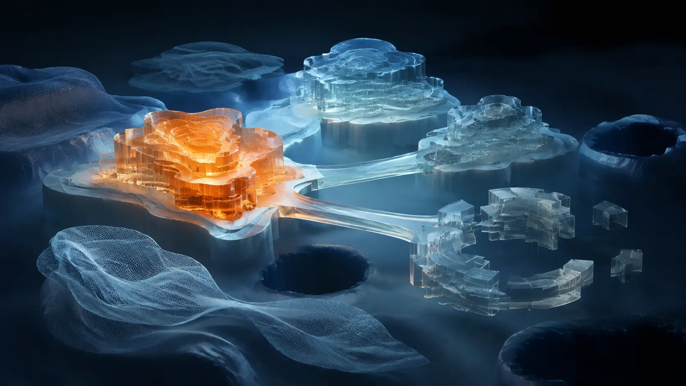

# Where the Framework Currently Stands

*What is derived, what corresponds, what is still being completed, what remains unresolved, and how earlier framings resolved. Updated as things move.*

> **Image Caption:** The framework is not one field of equal certainty; different claims stand on different kinds of support.

---

## Why this page exists

This framework is intentionally general. That is not the same thing as being unconstrained.

A programming language can express an enormous range of programs without making every execution arbitrary. What happens depends on the state, the available resources, and the logic actually present. The framework makes a similar claim: given the **present relational ground**, the **budget available through that ground**, and the **relations already seated**, only some further distinctions are affordable and only some further structures can become stable.

Its strongest prospective claim is therefore structural rather than a promise to calculate every concrete future state. It asks how new logic can acquire ground, how one kind of capacity makes another supportable, and whether that development continues to follow the Lane/Rung architecture instead of requiring unrelated new primitives.

The hope that originally motivated the framework was broader: that the universe is not finished in what it can support, and that structures which cannot stand now may become supportable after enough new ground has accumulated. That is a motivation, not permission for anything to happen at any present stage. Budget, compatibility, existing ground, and relational cost still constrain what can seat.

The actual methodological danger is **semantic drift**. If words such as *budget*, *relation*, *domain*, *resolution*, or *coarse* are allowed to change meaning whenever a new phenomenon appears, then almost any result could be retrofitted after the fact. The fixed-primitive rule exists to prevent that.

> **The framework may permit many outcomes. It should not permit arbitrary reasoning about why an outcome occurred.**

This page keeps the status of each claim visible so that a derived mechanism, a physical correspondence, a missing calculation, and a genuinely missing mechanism do not quietly become the same thing.

### How to read the status

This page now separates **where a claim stands now** from **what happened to an earlier formulation of it**.

#### Current-position labels

- **Derived** — follows from the framework's primitives without changing them.
- **Consequence** — follows from already-derived structure.
- **Candidate correspondence** — an observed phenomenon may instantiate the framework structure, but the physical or empirical identification is not yet complete.
- **Completion pending** — the mechanism or architecture is already present; a number, curve, physical mapping, formal rule, or other required completion is still missing.
- **Unresolved mechanism** — the framework-native mechanism, criterion, or structural joint itself has not yet been found.
- **Not established** — a possibility, extension, or physical lineage is permitted or suggested but has not earned status as framework ground.
- **Guardrail** — an interpretation must not be imported because it changes a primitive or confuses two quantities the framework keeps separate.

> **Completion pending means the mechanism exists but is incomplete. Unresolved mechanism means the mechanism itself is still missing.**

#### Resolution-history labels

When an earlier formulation changes, this page records **how it resolved** rather than treating every change as a discarded failure.

- **Rephrased** — the mechanism survived; the wording was misleading.
- **Reframed** — the issue survived, but it belongs at a different relation, grain, or layer.
- **Concluded** — the deduction reached a structural result, including when the answer is a limit or exclusion.
- **Narrowed** — a broad claim survived only in a more specific form.
- **Redirected** — the proposed route could not do the assigned job, but the deduction exposed the route that can.
- **Superseded** — later deduction now gives the more precise account.
- **Proven against** — the proposed formulation conflicts with already-derived framework structure. This is an internal deductive status, not a claim of experimental falsification unless explicitly stated.

> **A deduction does not owe the answer that was hoped for. It owes a consequence. The route can fail while the deduction succeeds.**

> **Image Caption:** Derived, candidate, incomplete, and unresolved claims remain connected without being collapsed.

> **Article Slot:** URL: https://soutame.substack.com/p/a-universe-made-of-logic-758

---

## Current integration checkpoint

The September 5 source sync integrates the twelve current Bits, the anchor-closure correction, and the later Stage/projection discussion into the maintained sources. The September 6 grain-sweep extension then adds an exact conditional repeat construction without promoting its physical inputs.

The additions are Stage and its relative Afference/Efference readings, anchor-closed comparison, consequence-specific re-seating cost, scoped projection geometry, receiver-Cut reconciliation, retained twin paths, the CMB resolution race and native-spectrum question, and a candidate support-transfer architecture for hosted logic.

These updates do not promote every physical mapping. They make the current mechanism and the remaining debt more precise.

## Derived internally

*These are framework-native deductions. Physical names are kept out of this section unless the physical identification itself has also been earned.*

### Structure and resolution

- **The Cut is relation.** At the deepest grain, the first consequential distinction need not connect two already-separate points. One undivided ground can self-differentiate through `R_AA`; once the roles become distinguishable, local bookkeeping can write them as `A`, `B`, and `R_AB`.
- **A relation is a distinction held together.** Split preserves enough difference for participants to remain distinguishable; sync preserves enough common ground for the difference to belong to one relation.
- **`A + B → A + B + R_AB` is local relational bookkeeping, not a claim that A and B are primitive substances.** A and B may themselves be relational compositions.
- **The present topology is both state and computational ground.** There is no separate framework-native RAM containing an unfinished reality.
- **Budget is tick-like resolving participation, not universal time.** The primitive participation rule can be common while effective capacity differs because relations themselves become participants and can carry compressed membership.
- **Budget composes through relation.** A densely related domain can do more relational work per primitive iteration without requiring a faster fundamental clock.
- **Resolution Equality does not imply Resolution Sameness.** Common primitive participation can coexist with very different effective capacity and persistence organization.
- **Budget comparisons are anchor-closed.** Include every consequential anchor. Common support may be omitted only without losing a distinction, and composite grouping must preserve the relations needed downstream.
- **Finite does not mean fixed.** Every newly seated relation adds ground and a new route of participation, while possible relations proliferate faster still. Growth therefore increases both capacity and scarcity.
- **Resolution costs.** A coarse state is not an unfinished fine state; it is a real constraint that does not pay for distinctions that are not consequential.
- **A seated Cut/relation is already resolution at its grain.** Resolution is precisely the seating of a distinction that has become consequential. The same relation also defines the complementary open side: distinctions it does not make consequential can remain equivalent relative to the new ground.
- **Coverage is not resolution.** A relation may have broad reach while remaining coarse in grain.
- **Grain and scope are independent.** A coarse relation can be extremely high-leverage without becoming finely specified.
- **Stored history is not rendered detail.** The present topology can preserve enough constraint to bound later resolution without storing a fully rendered past.
- **Stored, accessible, and presently rendered are different states.** Failure to retrieve a relation does not by itself mean it was erased.
- **Points and domains are grain-relative, and their unity can itself be relationally produced.** An atom, person, planet, seated relation, or larger structure can count as one point when it participates as one at the grain being considered; at a sufficiently expanded grain, that point/domain can be read as stabilised relational composition.
- **Referability-as-one recurs without ontological reset.** When a relational composition stabilises enough to participate as one, it can occupy a local zero-role relative to the next unresolved distinction. This does not recreate the original Level 0 or erase accumulated ground.
- **Identity is topological; size is relational.** Uniformly changing seating density does not by itself change relational identity if the relational pattern is preserved.
- **Interiority is routing before geometry.** A boundary makes a collection act as one by constraining routes between inside and outside.
- **Path is memory.** Repeated relation changes what becomes cheap to resolve next.
- **Stage is where relation meets an anchoring domain.** Light means relation and Space means the domain in this vocabulary; human observation is not required.
- **Afference and Efference are relative orientations.** The same relation can be outward for one domain and inward for another. A returning loop can reuse support without making participation costless.
- **Past and future do not require separately rendered Stages.** Past is surviving present constraint; future is projection and open possibility relative to present ground.

### Relational bias and path formation

- **No relation requires an anti-relation.** Opposition, alignment, sameness, and separation are possible contents of relation.
- **Compatibility is relation-specific rather than globally one-dimensional.** The same pair can share ground under one relation while preserving consequential difference under another.
- **A two-point relation can carry both orientation and bias.** `from / to` gives orientation; the relation can also preserve equivalence or preserve difference.
- **Sameness thickens a point; difference extends a path.** Repeated equivalence tends toward one effective class at coarse grain, while repeated preserved distinction can keep adding consequentially new points along an oriented path.
- **A path is successive distinction with orientation.** A next point has to remain different enough from the previous one to count as a new consequential point.
- **Incompatibility is still relation.** If two claims cannot be collapsed into one under the relation being asked, the distinction itself can seat as `R_≠`.
- **There is no exact relational antipode.** If two things can appear on the same relational surface, enough shared ground already exists for the comparison; perfect no-relation is therefore an excluded limit rather than another seated endpoint.

### Persistence, anchoring, and growth

- **To persist is to keep paying for the distinctions by which a domain remains distinguishable.**
- **Anchoring is relational and size-independent.** `R_AB` can provide reusable support/reference to A and B at different grains; one can anchor the other under one question and the direction can reverse under another. Contributions need not be equal. Larger domains can also maintain relational distinctions that many components reuse instead of each component paying the full outside cost independently.
- **Action and reaction are not symmetric costs.** New binding costs; later resolution through already-seated structure can become comparatively cheap.
- **Re-seating cost follows consequence.** It depends on which existing relations a change makes consequential, not simply how many relations the named object contains.
- **Projection is outgoing possibility or bias; interference is incoming consequence.** Several weak projections can become consequential together, and projection can be interrupted when its support changes.
- **No external selector chooses a law.** Whatever the present logic permits can grow, and the compatible structure requiring the least relational work per further unit can dominate the surfaced behaviour.
- **Fastest growth means lowest relational cost per further stable unit, not greatest total budget.**
- **Growth has several simultaneous channels.** Point/count growth, denser shared relation, configuration/dynamic growth, and logical/reusable-ground growth can continue together while their relative costs change.
- **Growth is also reuse.** Previously expensive structure can become reusable ground, reducing the price of later additions.
- **Expansion is not the opposite of contraction.** Within the framework, observable scale difference comes from differential seating/contraction between related grounds, not from comparing either one to an outside ruler.

### Lane and Rung architecture

- **Domain and possibility are complementary descriptions of one stage.** P-Lane asks `ground → possibility`; Informational Topology asks `possibility → ground`.
- **Aim can be known while fine implementation is outstanding because Aim itself is already seated relational constraint at its grain.** One coarse constraint can be resolved as present ground while many finer implementations remain equivalent. Aim therefore does not need a separate transition into topology.
- **Hosted is real, but hosted is not independently seated.** A Lane capacity can operate through structure that already stands for other reasons and has its own interference and projection at its participating grain.
- **Independent support must name the dependency and grain.** Release from one host's repeated reconstruction does not mean absence of all supporting relation.
- **Established logic can function as reusable ground inside a host without thereby becoming a new independent Rung.** Independent seating is a stronger condition than a logic merely being stable and consequential inside something else.
- **Higher structure recruits lower structure; it does not replace it.** Several Lane relations can operate through the same local ground at once.
- **Odd/even Lane pairs begin together.** The odd Lane opens a new freedom and the even Lane begins the stability problem created by that freedom. Onset, independent seating, and mature stabilisation are different milestones.
- **Rungs are reached by generativity, not addition.** More instances thicken a level; a new Rung requires the collective relation to become a new kind of participant.
- **The retrospective alignment organises; the prospective alignment predicts.** The upper Lane architecture can fail if later independent Rungs do not resolve into the capacities the Lane side says should become supportable.

### Measurement and clocks

- **Time is not primitive.** A clock is a selected repeating persistence loop, not an outside measure of total resolving capacity.
- **Clock rate is not total computational activity.** A selected repetition cannot measure every relation supported by its ground. Changed maintenance support remains a candidate account, not a universal numerical rule for every slower clock.
- **Present-ruler duration is not automatically remote event count.** A duration assigned to another ground is a cross-ground comparison; remote event rate, simple point growth, configuration growth, and logical growth are different quantities.
- **Uniform local change is locally invisible when the ruler co-seats with the same ground.** A ruler cannot measure its own changing length.
- **Consequential horizon is relational, not owned.** How far one domain can matter depends on the pair and on which side can pay for the relation.
- **Reality pays for distinctions, not detail.** Measurement supplies enough resolving structure to make a distinction consequential; it does not grant arbitrary content.
- **Budget is primitive capacity, not physical energy or stress-energy.** Energy, momentum, pressure, stress, and related physical quantities remain surfaced bookkeeping that the framework must still map quantitatively.

---

## Structural correspondences and candidate physical mappings

*The framework has a mechanism with the right qualitative structure. This is not the same as having reproduced the full physical theory or its measured numbers.*

### Geometry and propagation

- **Radial dilution / inverse-square.** In an effective `d`-dimensional radial topology, boundary measure scales as `r^(d-1)`, so a conserved radial reading surfaces as `1/r^(d-1)`. Inverse-square is the `d = 3` case, not a primitive exponent built into the framework.
- **Coordinate non-privilege.** The framework naturally treats coordinates as bookkeeping over relation rather than ontological structure. This is a structural correspondence to covariance, not yet a derivation of the full mathematics of general relativity.
- **Ballistic and neighbourhood/volume propagation.** Path-like and distributed seating can be understood as different topologies of one relational process rather than different primitive substances.
- **Reflection at a uniform boundary.** If the boundary makes normal traversal incompatible while introducing no new tangential distinction, the tangential relation is preserved and the normal component reverses. This gives the equal-angle structure; phase, amplitude, polarization, and full wave optics remain pending.
- **Refraction / transparency / colour / white-light splitting.** The framework has candidate relational-cost readings for these optics phenomena, but the exact measured optical relations remain physical mappings still pending rather than derived facts.

### Scoped projection geometry and comparison

- **Simple two-projection factor — conditional construction completed.** With two independent one-dimensional projections, orthogonal representation, and no additional consequential `R_ap` bias, `R_all² = R_a² + R_p²` gives `q = R_p/R_all = sqrt(1 - (R_a/R_all)²)`. Under the proposed identification `R_a/R_all ↔ v/c`, the familiar `1/γ` factor follows.
- **Ruler contraction — candidate correspondence / completion pending.** The simple construction uses `L = qL₀`. It does not follow from an arbitrary budget ratio or from optical appearance.
- **Receiver-Cut reconciliation — candidate mechanism / completion pending.** Unequal anchor-closed support can produce different source resolution per receiver Cut. A ratio such as `B_ra/B_la` is a cadence comparison, not automatically `q`, `γ`, or inverse length.
- **Twin path comparison — mechanism clarified / generalization pending.** Paths retain accumulated relation. A turn reverses orientation without deleting earlier consequence; reunion exposes rather than creates the difference.
- **Binding and causal structure — guardrail / completion pending.** Immediate coarse binding and budget-limited resolution do not establish instantaneous measurable signalling.

### Persistence, motion, and physical accounting

- **Mass / inertia.** Internal persistence commitment and the cost of changing a seated state provide a candidate architecture for mass-like and inertia-like bookkeeping. The framework has not yet derived the numerical mapping to physical mass.
- **Free fall / gravity-like motion.** Differential co-shrink / re-seating of separation remains the candidate force-free picture. The newer budget clarification suggests that dense relational composition may increase effective resolving work per primitive iteration and therefore strengthen coarse anchor effects, but the mapping from relational throughput to measured gravity is not yet derived. Full quantitative correspondence to general relativity remains pending.
- **Gravitational clock differences.** The clock architecture provides a candidate interpretation in terms of differently supported persistence loops. Quantitative reproduction of measured gravitational time dilation remains a physical-mapping task.
- **Conservation.** The framework expects strong local conservation-like bookkeeping where quantities are read through one local ground, while refusing to treat a global energy substance as primitive. The successful conservation equations still have to be recovered, not assumed.
- **Friction.** Contact becoming consequential, motion invalidating part of the interface seating, and repeated re-seating provide a candidate mechanism. Tribological detail remains open as physical mapping.

### Electromagnetic branch

- **Relational wave architecture.** The primitive account uses a continuing relation rather than an independently travelling light-object.
- **Affordability of an additional EM/atomic distinction.** Conceptually resolved: a new distinction can seat only when present support can pay its relational cost. Actual atomic, molecular, conductor, and EM thresholds remain quantitative completions still pending.
- **Magnetic polarity.** Repeated biased directional distinctions provide a candidate architecture in which a pole is an exposed side of a directional relation. Cutting an ordinary magnet-like domain creates new boundaries and therefore new exposed ends rather than isolating one end. This does **not** yet derive full electromagnetism or prove that fundamental magnetic monopoles are impossible.
- **No primitive `c`.** The framework does not posit an underlying `c` that secretly varies or remains fixed. If the physical mapping works, local `c` is a surfaced ratio among propagation and rulers seated in the same ground. Cross-ground propagation remains a quantitative pending completion.

### Density regimes and condensation

- **Vacuum, gas, liquid, and solid are not Lane numbers.** They are candidate organizations of persistence in the same relational ground, through which several Lane relations may operate simultaneously.
- **Boundary support and pressure.** Gas, membrane, outside pressure, load, and ground can form one load-bearing closure. Pressure is proposed as a Stage-visible boundary comparison, not a numerical synonym for framework budget.
- **Propagation through different density regimes.** The candidate mechanism is relational cost per further unit: a denser ground can make more surrounding relation consequential per traverse, while higher-order relations require more coordinated structure per step. Measured speeds and refractive ratios remain pending.
- **Anchoring as a density-stability economy.** A shared boundary/anchor can let interior distinctions reuse persistence support. This is a candidate route toward stable dense regimes; actual phase boundaries and condensed-matter equations remain pending.
- **Physical, dynamic, and logical condensation can coexist.** The architectural result is derived; mapping it onto cosmological, biological, and cultural history remains candidate correspondence.

### Dark-sector and cosmology branch

- **Dark matter as coarse relational coverage.** Candidate: a domain's relational coverage may extend beyond the grain at which fine collision-like interaction is available. This could unify darkness, collisionlessness, extension, and gravitational participation under one cause.
- **Vacuum/background response.** The current candidate answer is that a sufficiently uniform unanchored background sets a common condition rather than producing a local differential. This is a candidate response to the vacuum objection, not a quantitatively closed solution.
- **Halo-overlap prediction.** If overlapping coarse anchored regions must seat additional shared relation, the framework predicts a positive overlap-associated excess beyond simple additive superposition. Magnitude and detectability remain pending.
- **Redshift / remote event-rate comparison.** Candidate: spectral shift and whole-event duration stretching may both expose a cross-ground counting mismatch. This does not yet replace conventional cosmology; the numerical map, CMB consistency, lensing, flux, and structure-growth constraints remain pending.
- **Earlier slow event rate versus cheap simple growth.** The framework permits a remote/earlier ground to resolve events more slowly against our current ruler while still adding simple structure cheaply per budget because fewer existing relations have to be integrated.
- **CMB resolution race.** Candidate: fine nested composition can grow resolution density faster than a continuing coarse background while both retain fundamental participation. Coarse does not mean static, underfunded, or intrinsically hot.
- **CMB native spectrum.** The question is which repeated-resolution rule generates the measured distribution and scaling. A receiver/target grain sweep now has an explicit conditional repeat construction: a local `q_A(rho)` fixed over repeats but variable across grain gives `W_A(rho)q/(1-q)`. Its physical identification remains candidate. The earlier `x² sqrt(1-x²)` hump remains a separate toy, not Planck's law.
- **Grain sweep and repeated weights.** Conditional mathematics is present: summing stationary local repeat weights gives `W/[exp(chi)-1]`, where `chi=-ln(q)`. The Planck illustration supplies conventional `chi=hν/(k_BT)` and `W∝ν³`; deriving those inputs and their normalization from anchor-closed native relations remains completion work. Changing repeat factors require products, and changing spectral bins requires the correct density conversion.
- **Dark-energy-like expansion.** Differential contraction between dense and sparse grounds remains a candidate large-scale interpretation, not a quantitative cosmological result.

### Nuclear, biological, and higher-order branches

- **Nuclear support-sharing.** Candidate: compatible nuclear structure may become cheaper to maintain as one supported domain than as separately maintained domains. The full binding/stability curve, isotope pattern, decay hierarchy, and fusion limits remain pending.
- **Star-like and planet-like regimes.** Coarse-to-fine development permits a candidate relation between large coarse domains and later finer differentiated regimes. It does not establish a literal observed star-to-planet lineage.
- **Law → statistics → forecast.** The Lane architecture gives a candidate reason compact law-like description becomes less useful as configuration and history become consequential. The proposed approximate property threshold remains empirical and unconfirmed.
- **Living / logical condensation.** Living systems and human/cultural/software logic are candidate surfaces where relational growth increasingly occurs through persistent alteration and reusable logic rather than proportional physical contraction. This is not yet a derived biological law.

---

## Where completion is still pending

*These entries already have a mechanism, architecture, or candidate route. What remains is the work needed to complete the claim.*

### Quantitative completion pending

- **Halo magnitude and overlap magnitude** — the dark-sector mechanism does not yet give the required lensing / mass numbers.
- **Compounding rate** — proportional scalar change can be written as an exponential of accumulated rate, including a changing rate. The native rate and its physical identification are not yet calculated.
- **Density-regime propagation** — the relational-cost mechanism exists, but measured light, sound, conduction, diffusion, and refractive ratios are not yet derived.
- **EM / atomic thresholds** — the affordability condition exists; actual thresholds are not yet calculated.
- **Cross-ground clock / redshift mapping** — the scoped projection factor and receiver-Cut mechanism exist. The remaining task is a general function from specified closure to spectral and event-duration ratios, including gravity and cosmology. The scoped result must not be reset to “no mathematical account.”
- **CMB distribution and scaling** — the geometric repeat sum and its conditional low/high-frequency behavior are explicit. Native identification of the repeat rule, physical argument, weighting, and normalization remains incomplete; redshift–temperature scaling and anisotropy/acoustic structure remain separate completion items.
- **Nuclear stability curve** — support-sharing gives a candidate mechanism; observed binding, isotope, fusion, and decay magnitudes are still missing.
- **Coarse-to-fine Aim / constraint mapping** — the structural joint is now clear: Aim is already seated topology and later fine resolution is another Cut within that present constraint. What remains incomplete is a formal / quantitative account of how the Aim combines with other present ground and relational cost to make one finer distinction consequential rather than another.
- **Lane growth scaling** — the structural distinction among simple count growth, configuration growth, and reusable logical growth exists; their relative rates remain qualitative.
- **Physical accounting** — energy, momentum, pressure, stress, thresholds, and force-like equations still have to be reproduced from relational settlement rather than renamed.
- **Effective-dimension mapping** — the framework already has a qualitative mechanism: measured dimension reflects which relational directions / traversals the present ground can afford and support, while the Lane/Rung ladder constrains which capacities are available. What is still missing is a quantitative rule mapping a specified ground and budget to a measured effective dimension.

### Physical mapping pending

- **Electromagnetism** — Maxwell-level structure, induction, charge behaviour, field geometry, strengths, propagation, and polarization remain to be reproduced.
- **Magnetic polarity** — ordinary dipole regeneration has a candidate mechanism; a general result about fundamental monopoles has not been established.
- **Reflection and refraction** — the structural reflection geometry is accounted for at a uniform boundary; full wave-optics behaviour and refractive mapping are still incomplete.
- **Matter-density regimes** — shared anchoring provides a candidate density-stability mechanism; phase-transition equations remain incomplete.
- **Gravity / clocks / motion** — the scoped inertial factor is present. Complete simultaneity, Doppler relations, velocity composition, general acceleration, many-anchor geometry, and quantitative gravity remain incomplete.
- **Redshift / cosmology** — the candidate cross-ground interpretation must reproduce the same successful observational web rather than fit isolated phenomena.
- **Star-like / planet-like regimes and supernova restructuring** — the coarse-to-fine architecture and generic re-seating mechanism exist, but the actual astronomical lineage / regime mapping is not established.

### Independent seating pending

- **Higher hosted logic generally** — language, institutions, models, translation, and other stable logics can become reusable ground while remaining host-dependent. Which capacities later acquire independent seating is not assumed from hosted operation alone.

- **Hosted support transfer — candidate architecture.** A proxy supplies continuity, a quest supplies an occasion for participation, and a Tower supplies a bounded test. The aim is growth through support made reusable, not indefinite maintenance by one central System.
- **System perspective and shared infrastructure — candidate design.** A shared capability may render through different local interfaces. This is a proposed route, not evidence that a new independent Rung exists.

The Lane-7 question is narrower now: support dependencies can be named, but the sufficient topology for independent seating remains unresolved.

---

## Interpretive coverage

*The framework can currently give these subjects an internal reading, but the reading has low evidential weight until it produces a sharper consequence or quantitative mapping.*

- **Rotation and support versus accumulated budget.** Rotational clock behaviour may separate persistence support from accumulated capacity; the exact framework-native account is unresolved.
- **Flame, snowflake, crack, and digital-storage comparisons.** These illustrate identity through alteration, exact coarse constraint, retained route bias, and logical preservation without microscopic identity. They do not derive the respective physical theories.
- **Brain/body as the Stage expression of perceptual-domain resolution.** This stronger proposal remains exploratory. Neural activity may precede movement and interruption may change projection; that coupling does not establish the ontology.
- **Apparent noise as unresolved overlapping projection.** Exploratory, not a general explanation of measured randomness or evidence of an intended sender.
- **Recurring large-scale forms.** Shared coarse ground can bias families of stable outcomes without transmitting a rendered blueprint. The framework has not yet derived which concrete morphologies become stable from a specified ground.
- **Inflation-shaped early mismatch.** A very large early difference in resolving ground could have an inflation-like qualitative shape, but amplitude, duration, termination, and perturbation spectrum are not derived.
- **Hubble tension.** Different grain relations can permit different inferred values, but merely permitting two values predicts neither of them.
- **CMB horizon versus ontological horizon.** A resolution boundary need not be an edge of existence. This is permitted by the framework but presently weak as a discriminator.
- **Apparatus resolution density.** The framework already supplies the candidate mechanism: a probe fine enough to resolve a given grain is itself a local concentration of resolving structure. What remains is an experimental or quantitative discriminator showing when that contribution becomes measurable rather than merely a methodological caution.

---

## Unresolved mechanisms

*Only questions whose framework-native mechanism or criterion is still missing belong here.*

- **General bias composition into surfaced metric geometry.** The independent low-bias two-projection construction is present. The missing general rule concerns consequential `R_ap` bias and multiple closures: how specified topology fixes separation, orientation, angle, contraction, and geodesic bookkeeping.
- **Physical bias criterion before the surfaced outcome is known.** The structural meaning of compatibility and incompatibility is derived, but the framework does not yet have a framework-native rule that fixes a concrete physical relation's bias before looking at the physical result.
- **Lane 7 independent seating.** Support-transfer architecture identifies dependencies to preserve or relocate, but the sufficient structure for independent establishing capacity has not yet been derived.
- **Prospective coarse compatibility.** Present projection and a hosted counterpart already are relations at their grain. The unresolved part is an independent test of later compatibility beyond present participation and retrospective interpretation.

---

## Earlier framings and how they resolved

*This is not a graveyard of “wrong ideas.” In this deduction process, a proposed route often resolves by showing why it cannot do one job and, in the same step, revealing what the structure does instead.*

- **Isolated budget → anchor-closed comparison — Superseded.** Bare symbols cannot discard support that distinguishes the grounds; composite grouping must preserve consequential relation.
- **All clock/ruler geometry missing → scoped factor present, general rule unfinished — Narrowed.** The simple construction exists under explicit assumptions. It does not complete relativity or equal an arbitrary budget ratio.
- **Turnaround creates the twin difference → retained path comparison — Reframed.** Orientation reversal changes continuation, not the consequences already accumulated.
- **CMB gets less budget or carries an assumed primordial curve → resolution race and native spectrum — Redirected.** Preserve fundamental participation and derive the distribution-generating rule before scaling it.
- **One universal multiplier → local repeat factor within a changing grain sweep — Narrowed / clarified.** Constancy over repeats at one selected comparison does not require constancy across all grain comparisons. The exact conditional sum remains; the graph does not supply its native physical inputs.
- **Hosted means only the host acts → hosted logic participates at its grain — Rephrased / reframed.** Visibility, access, ongoing activity, and independent seating remain distinct.
- **System maintains every logic forever → System establishes reusable support — Reframed.** Proxy, quest, and Tower name different support roles.
- **Neural mirror means an after-event record → interruptible realization after projection — Rephrased.** Neural activity may precede movement; the ontology remains exploratory.
- **Aim-to-topology joint → Aim already seated as topology — Concluded / narrowed.** The old question assumed Aim might be a separate possibility-layer constraint that had to become topologically effective later. The Cut/resolution clarification closes that gap: any real present Aim is already seated relational constraint at its grain. What remains is the narrower coarse-to-fine mapping problem of which later distinction becomes consequential through that Aim and the rest of present ground.
- **Anticipatory intention as future steering — Proven against / redirected.** A present aim can constrain later resolution by changing the present domain and its future participation, but the framework does not provide a route by which an aim reaches forward and selects an already-finished future result.
- **Steering through an unowned possibility field — Concluded / redirected.** Wider unresolved possibility can increase openness or variance; it does not by itself provide a hidden tilt. Direction has to be carried by seated constraint.
- **Uniform era-wide rate shift as an internal explanation — Concluded / redirected.** If an entire local ruler-ground co-shifts, local ratios co-shift with it and the change is locally invisible. That result redirects the useful mechanism toward comparison across differently seated grounds.
- **Closure → stabilisation — Rephrased / concluded.** The earlier word suggested completion. The derived architecture instead requires a Rung to stabilise enough to support further structure while remaining active underneath it.
- **Vacuum / gas / liquid / solid as Lane numbers → density regimes carrying several Lane relations — Reframed.** Material-state labels belong to candidate density / anchoring regimes of shared ground, not to Lane identity.
- **Primitive or secretly varying `c` → surfaced local ratio — Reframed / guardrail.** The framework has no primitive `c` to vary or keep fixed. Local `c` is treated as surfaced bookkeeping among propagation and rulers seated in the same ground.
- **Gravity as an active force or lower-total-compute gradient → relational re-seating / differential contraction — Reframed.** Force or gradient language may describe a surface, but it is not the primitive mechanism.
- **More budget means a faster clock → clock as maintenance frequency — Concluded / reframed.** Clock repetition tracks a selected persistence loop rather than total resolving capacity.
- **Saturation as the mechanism of clock slowing → supported persistence and scoped projection — Superseded.** Support remains a candidate, sharpened by low-bias geometry. Neither primitive saturation nor a universal “cheaper means slower” rule has been derived.
- **Coarse as unfinished, blurry, weak, or less real → undercommitted relative to a consequential grain — Rephrased / concluded.** Grain and scope are independent; coarse structure can be broad and powerful.
- **Stored history as fully rendered past detail → present constraint — Reframed / concluded.** History can survive as seated constraint sufficient to bound later resolution without a separately rendered archive.
- **Exact 180° relational antipode — Concluded.** Exact no-shared-relation cannot appear as another seated point on the same relational surface. The exact endpoint is an excluded limit, while surfaced oppositions can still exist.
- **A switch from physical condensation to dynamic or logical condensation → simultaneous channels with changing relative cost — Reframed / concluded.** The modes can grow together; what changes is which route becomes comparatively cheap.
- **Budget as physical energy or stress-energy → primitive capacity versus surfaced physical accounting — Reframed / guardrail.** Budget remains primitive capacity; physical energy and stress-energy remain mapping targets.
- **Literal established star → rocky planet lineage — Narrowed / not established.** The framework retains a coarse-to-fine regime relation as a candidate architecture, but it has not established a literal observed stellar-to-planetary lineage.
- **Earth as chooser → shared ground and local resolution — Reframed / redirected.** Recurrence can follow from shared constraints and local seating without a higher domain choosing individual outcomes.

> **A negative answer can still be a positive deduction: the failed route becomes information about what the structure can and cannot do.**

---

## What this page is and is not claiming

**Successful measurements and equations remain constraints.** When the framework claims a physical correspondence, it eventually has to reproduce the relevant measured relations. What it does **not** automatically import is the conventional ontology used to interpret those measurements.

**The framework is not limited to structures already observed.** A deduction may permit a capacity that has not yet independently appeared. That permission is not evidence by itself; its value comes from the dependency it states in advance and the possibility that later resolution could contradict it.

The working stance is:

> **Keep the evidence. Keep the primitive meanings fixed. Derive first. Then ask what, if anything, the derived structure corresponds to.**

An unresolved mechanism is allowed to remain unresolved while its mechanism is genuinely missing. Once a mechanism exists, the item moves to a more precise current position such as Derived, Candidate correspondence, Completion pending, Not established, or Guardrail. Earlier wording is recorded separately by how it resolved: rephrased, reframed, concluded, narrowed, redirected, superseded, or proven against.

A status item that never changes despite new deduction is not automatically strong. It may simply be stale.
